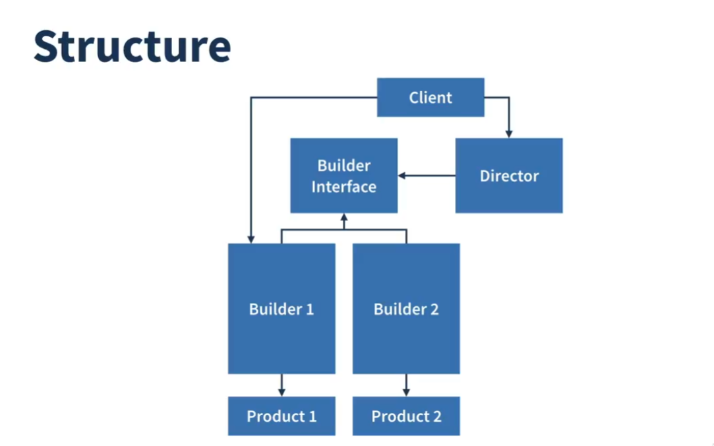
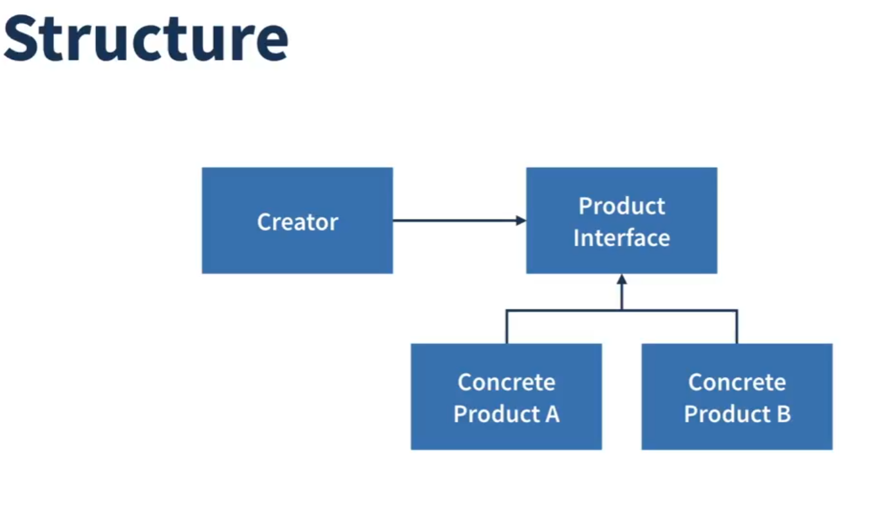
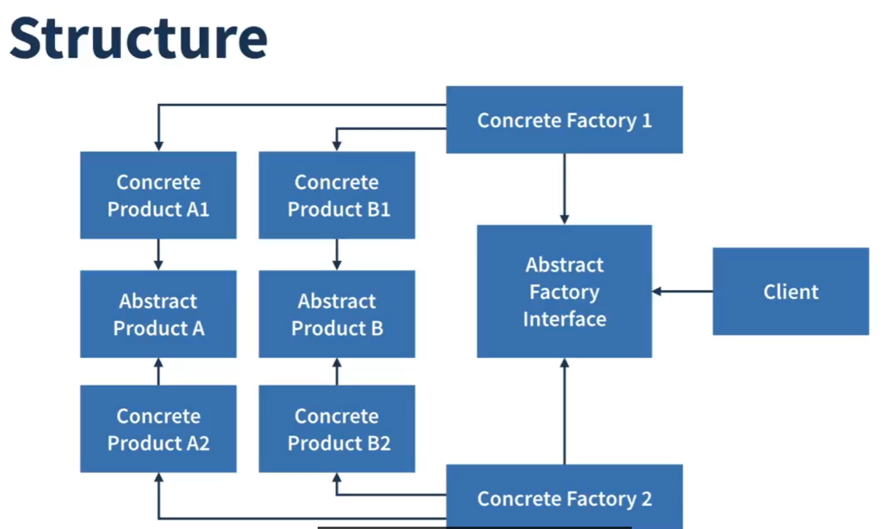
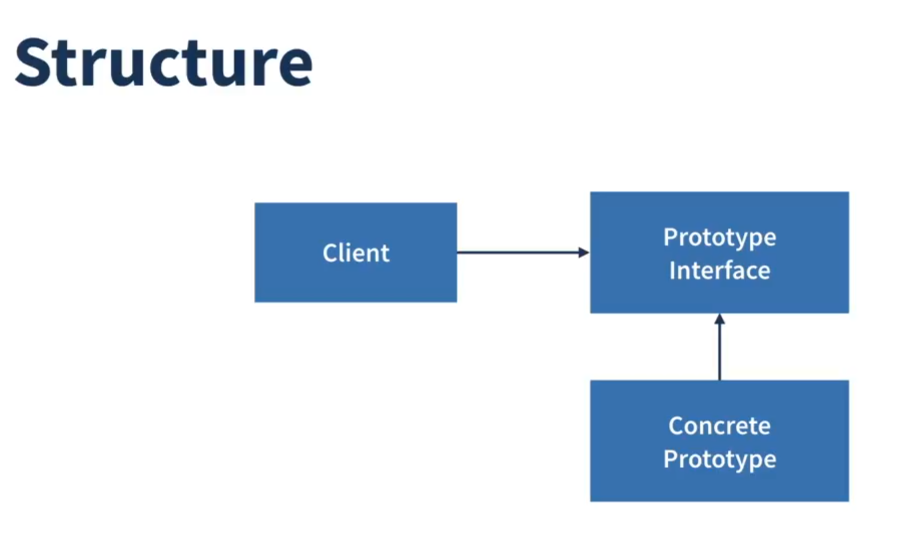
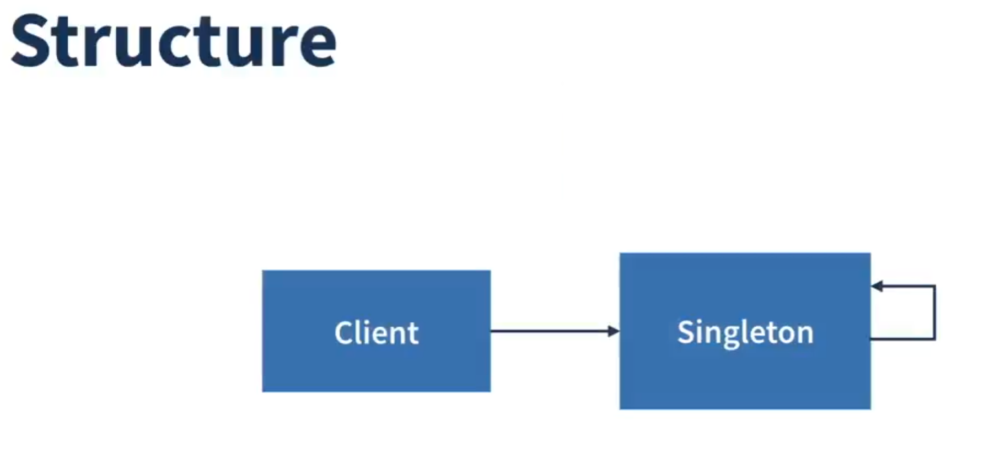

# Typescript Design Patterns
Creational, Structural and Behavior patterns with typescript

## Patrones Creacionales

Estos patrones se centran en los mecanismos de creación de objetos. Su objetivo es crear objetos de una manera que se adapte a la situación, proporcionando una mayor flexibilidad y reutilización del código. En lugar de instanciar objetos directamente con el operador `new`, los patrones creacionales delegan la responsabilidad de la creación de objetos a clases especiales. Esto ayuda a reducir la complejidad y a desacoplar el código cliente de las clases concretas que necesita instanciar.

Algunos de los patrones creacionales más comunes son:
- **Factory Method:** Permite que una interfaz cree objetos en una superclase, pero deja que las subclases alteren el tipo de objetos que se crearán.
- **Abstract Factory:** Permite producir familias de objetos relacionados sin especificar sus clases concretas.
- **Builder:** Permite construir objetos complejos paso a paso.
- **Singleton:** Asegura que una clase solo tenga una única instancia y proporciona un punto de acceso global a ella.
- **Prototype:** Permite copiar objetos existentes sin que el código dependa de sus clases.

## Patrones Estructurales

Estos patrones se ocupan de la composición de clases y objetos para formar estructuras más grandes y complejas. Facilitan el diseño al identificar una forma sencilla de realizar relaciones entre entidades, asegurando que si una parte del sistema cambia, el sistema entero no necesite hacerlo.

Algunos de los patrones estructurales más comunes son:
- **Adapter:** Permite la colaboración entre objetos con interfaces incompatibles.
- **Bridge:** Permite dividir una clase grande o un conjunto de clases estrechamente relacionadas en dos jerarquías separadas (abstracción e implementación) que pueden desarrollarse independientemente la una de la otra.
- **Composite:** Permite componer objetos en estructuras de árbol y luego trabajar con estas estructuras como si fueran objetos individuales.
- **Decorator:** Permite añadir nuevas funcionalidades a un objeto colocando estos objetos dentro de "envoltorios" especiales que contienen las funcionalidades.
- **Facade:** Proporciona una interfaz simplificada a una biblioteca, un framework o cualquier otro conjunto complejo de clases.
- **Flyweight:** Permite que un gran número de objetos quepan en la memoria RAM disponible compartiendo partes comunes de estado entre múltiples objetos en lugar de mantener todos los datos en cada objeto.
- **Proxy:** Proporciona un sustituto o marcador de posición para otro objeto para controlar el acceso a él.

## Patrones de Comportamiento

Estos patrones se centran en los algoritmos y la asignación de responsabilidades entre los objetos. No solo describen patrones de objetos o clases, sino también patrones de comunicación entre ellos.

Algunos de los patrones de comportamiento más comunes son:
- **Chain of Responsibility:** Permite pasar solicitudes a lo largo de una cadena de manejadores. Al recibir una solicitud, cada manejador decide si la procesa o si la pasa al siguiente manejador de la cadena.
- **Command:** Convierte una solicitud en un objeto independiente que contiene toda la información sobre la solicitud.
- **Iterator:** Permite recorrer elementos de una colección sin exponer su representación subyacente (lista, pila, árbol, etc.).
- **Mediator:** Reduce las dependencias caóticas entre objetos. El patrón restringe las comunicaciones directas entre los objetos y los obliga a colaborar únicamente a través de un objeto mediador.
- **Memento:** Permite guardar y restaurar el estado anterior de un objeto sin revelar los detalles de su implementación.
- **Observer:** Permite definir un mecanismo de suscripción para notificar a múltiples objetos sobre cualquier evento que le suceda al objeto que están observando.
- **State:** Permite que un objeto altere su comportamiento cuando su estado interno cambia. Parece como si el objeto cambiara su clase.
- **Strategy:** Permite definir una familia de algoritmos, colocar cada uno de ellos en una clase separada y hacer que sus objetos sean intercambiables.
- **Template Method:** Define el esqueleto de un algoritmo en la superclase pero deja que las subclases sobrescriban pasos específicos del algoritmo sin cambiar su estructura.
- **Visitor:** Permite separar algoritmos de los objetos sobre los que operan.

---

## Patrón de Diseño Builder (Constructor)

El patrón **Builder** es un patrón de diseño creacional que te permite construir objetos complejos paso a paso. El patrón te permite producir distintos tipos y representaciones de un objeto utilizando el mismo código de construcción.

### Problema que resuelve

Imagina un objeto complejo que requiere una inicialización laboriosa con muchos campos y objetos de configuración anidados. Dicho código de inicialización suele estar sepultado dentro de un constructor monstruoso con una gran cantidad de parámetros. O, peor aún, esparcido por todo el código cliente.

Por ejemplo, pensemos en cómo crear un objeto `Casa`. Para construir una casa sencilla, necesitas cuatro paredes y un suelo, pero para una casa más grande, además quieres un tejado, un jardín, una piscina, etc. En este caso, tendrías un constructor con muchos parámetros, la mayoría de los cuales no se utilizarán en la mayoría de los casos.

### ¿Cómo funciona?

El patrón Builder sugiere que extraigas el código de construcción del objeto de su propia clase y lo muevas a objetos separados llamados *builders*.

El patrón organiza la construcción de objetos en una serie de pasos ( `buildParedes()`, `buildPuertas()`, etc.). Para crear un objeto, ejecutas una serie de estos pasos en un objeto builder. La parte importante es que no necesitas llamar a todos los pasos. Solo puedes llamar a los pasos que son necesarios para producir una configuración particular de un objeto.

Cuando el objeto está construido, solicitas el resultado al builder.

### Estructura

1.  La interfaz **Builder** declara los pasos de construcción del producto que son comunes a todos los tipos de builders.
2.  Los **Builders Concretos** proporcionan diferentes implementaciones de los pasos de construcción. Los builders concretos pueden producir productos que no siguen la interfaz común.
3.  Los **Productos** son los objetos resultantes. Los productos construidos por diferentes builders no tienen por qué pertenecer a la misma jerarquía de clases o interfaz.
4.  El **Director** define el orden en el que se deben ejecutar los pasos de construcción para poder crear y reutilizar configuraciones específicas de productos.
5.  El **Cliente** asocia uno de los objetos builder con el director.

### ¿Cuándo utilizarlo?

*   **Usa el patrón Builder para evitar un "constructor telescópico"**. Si tienes un constructor con muchos parámetros opcionales, el patrón Builder puede ser una buena solución.
*   **Usa el patrón Builder cuando quieras que tu código pueda crear diferentes representaciones de un mismo objeto**.
*   **Usa el patrón Builder para construir árboles Composite u otros objetos complejos**.

### Pros y Contras

#### Pros

*   Puedes construir objetos paso a paso, aplazar los pasos de construcción o ejecutar los pasos de forma recursiva.
*   Puedes reutilizar el mismo código de construcción al construir varias representaciones de productos.
*   Aísla el código de construcción complejo de la lógica de negocio del producto.

#### Contras

*   La complejidad general del código aumenta, ya que el patrón requiere la creación de múltiples clases nuevas.

---

## Patrón de Diseño Factory Method (Método de Fábrica)

El patrón **Factory Method** es un patrón de diseño creacional que proporciona una interfaz para crear objetos en una superclase, mientras permite a las subclases alterar el tipo de objetos que se crearán.

### Problema que resuelve

Imagina que estás creando una aplicación de logística. La primera versión de tu aplicación solo gestiona el transporte en camiones, por lo que la mayor parte de tu código se encuentra dentro de la clase `Camion`.

Después de un tiempo, tu aplicación se vuelve bastante popular. Cada día recibes decenas de solicitudes de empresas de transporte marítimo para que incorpores la logística marítima en la aplicación.

Agregar una nueva clase `Barco` al programa no es tan simple si el resto del código ya está acoplado a la clase `Camion`. Tendrás que hacer cambios en toda la base de código. Si luego decides agregar otro tipo de transporte, como `Avion`, probablemente necesitarás hacer todos estos cambios de nuevo.

### ¿Cómo funciona?

El patrón Factory Method sugiere que reemplaces las llamadas directas de construcción de objetos (usando el operador `new`) con llamadas a un método de fábrica especial. Los objetos devueltos por un método de fábrica a menudo se denominan "productos".

La superclase puede contener una implementación predeterminada del método de fábrica. Las subclases pueden anular este método para cambiar el tipo de producto que se está creando.

### Estructura

1.  La interfaz **Producto** declara la interfaz para los objetos que el método de fábrica crea.
2.  Los **Productos Concretos** son diferentes implementaciones de la interfaz del producto.
3.  La clase **Creador** declara el método de fábrica que devuelve nuevos objetos de producto. Es importante que el tipo de retorno de este método coincida con la interfaz del producto.
4.  Los **Creadores Concretos** anulan el método de fábrica base para que devuelva un tipo diferente de producto.

### ¿Cuándo utilizarlo?

*   **Usa el Factory Method cuando no sepas de antemano los tipos y dependencias exactos de los objetos con los que tu código debe funcionar.**
*   **Usa el Factory Method cuando quieras proporcionar a los usuarios de tu biblioteca o framework una forma de extender sus componentes internos.**
*   **Usa el Factory Method cuando quieras ahorrar recursos del sistema reutilizando objetos existentes en lugar de reconstruirlos cada vez.**

### Pros y Contras

#### Pros

*   Evitas un acoplamiento estrecho entre el creador y los productos concretos.
*   *Principio de Responsabilidad Única*. Puedes mover el código de creación del producto a un solo lugar, lo que hace que el código sea más fácil de mantener.
*   *Principio de Abierto/Cerrado*. Puedes introducir nuevos tipos de productos en el programa sin romper el código cliente existente.

#### Contras

*   El código puede volverse más complicado ya que necesitas introducir una gran cantidad de nuevas subclases para implementar el patrón. El mejor de los casos es cuando estás introduciendo el patrón en una jerarquía existente de clases creadoras.

---

## Patrón de Diseño Abstract Factory (Fábrica Abstracta)

**Abstract Factory** es un patrón de diseño creacional que te permite producir familias de objetos relacionados sin especificar sus clases concretas.

### Problema que resuelve

Imagina que estás creando un simulador de muebles. Tu código contiene clases que representan:
1.  Una familia de productos relacionados, digamos: `Silla` + `Sofa` + `Mesa`.
2.  Varias variantes de esta familia. Por ejemplo, productos `Silla`, `Sofa` y `Mesa` están disponibles en estos estilos: `Moderno`, `Victoriano`, `ArtDeco`.

Necesitas una forma de crear objetos de mobiliario individuales para que coincidan con otros objetos de la misma familia. Los clientes se molestan bastante cuando reciben muebles que no combinan.

Además, no quieres cambiar el código existente al agregar nuevos productos o familias de productos al programa. Los proveedores de muebles actualizan sus catálogos muy a menudo, y no querrías cambiar el código central cada vez.

### ¿Cómo funciona?

El patrón Abstract Factory sugiere que crees interfaces separadas para cada producto distinto de la familia de productos (por ejemplo, `Silla`, `Sofa` o `Mesa`). Luego puedes hacer que todas las variantes de los productos sigan esas interfaces.

A continuación, declaras la *Fábrica Abstracta* - una interfaz con una lista de métodos de creación para todos los productos que forman parte de la familia de productos (por ejemplo, `crearSilla`, `crearSofa`, `crearMesa`). Estos métodos deben devolver productos abstractos representados por las interfaces que extrajimos anteriormente: `Silla`, `Sofa`, `Mesa`.

Ahora, ¿qué pasa con las variantes de los productos? Para cada variante de una familia de productos, creamos una clase de fábrica separada que implementa la interfaz `FabricaAbstracta`. Una fábrica es una clase que devuelve productos de un tipo particular. Por ejemplo, la `FabricaMueblesModernos` solo puede crear objetos `SillaModerna`, `SofaModerno` y `MesaModerna`.

El código cliente tiene que trabajar con fábricas y productos a través de sus respectivas interfaces abstractas. Esto te permite cambiar el tipo de fábrica que pasas al código cliente, así como el tipo de producto que el código cliente recibe, sin romper el propio código cliente.

### Estructura

1.  Las **Interfaces de Producto Abstracto** declaran interfaces para un conjunto de productos distintos pero relacionados que forman una familia de productos.
2.  Los **Productos Concretos** son varias implementaciones de productos abstractos, agrupados por variantes. Cada producto abstracto (`Silla`/`Sofa`) debe ser implementado en todas las variantes dadas (`Victoriano`/`Moderno`).
3.  La interfaz de la **Fábrica Abstracta** declara un conjunto de métodos para crear cada uno de los productos abstractos.
4.  Las **Fábricas Concretas** implementan los métodos de creación de la fábrica abstracta. Cada fábrica concreta corresponde a una variante específica de productos y crea solo esas variantes de productos.
5.  Aunque las fábricas concretas instancian productos concretos, las firmas de sus métodos de creación deben devolver los correspondientes productos abstractos. De esta manera, el código cliente que utiliza una fábrica no se acopla a la variante específica del producto que obtiene de una fábrica. El **Cliente** puede trabajar con cualquier variante de fábrica/producto concreto, siempre y cuando se comunique con sus objetos a través de interfaces abstractas.

### ¿Cuándo utilizarlo?

*   **Usa el patrón Abstract Factory cuando tu código necesite trabajar con varias familias de productos relacionados, pero no quieras que dependa de las clases concretas de esos productos.**
*   **Considera aplicar el patrón Abstract Factory cuando tengas una clase con un conjunto de Factory Methods que desdibujan su responsabilidad principal.**

### Pros y Contras

#### Pros

*   Puedes estar seguro de que los productos que obtienes de una fábrica son compatibles entre sí.
*   Evitas el acoplamiento estrecho entre productos concretos y el código cliente.
*   *Principio de Responsabilidad Única*. Puedes extraer el código de creación del producto a un solo lugar, lo que facilita el mantenimiento del código.
*   *Principio de Abierto/Cerrado*. Puedes introducir nuevas variantes de productos sin romper el código cliente existente.

#### Contras

*   El código puede volverse más complicado de lo que debería, ya que se introducen muchas interfaces y clases nuevas junto con el patrón.

---

## Patrón de Diseño Prototype (Prototipo)

**Prototype** es un patrón de diseño creacional que te permite copiar objetos existentes sin que tu código dependa de sus clases.

### Problema que resuelve

Digamos que tienes un objeto y quieres crear una copia exacta de él. ¿Cómo lo harías? Primero, tendrías que crear un nuevo objeto de la misma clase. Luego, tendrías que recorrer todos los campos del objeto original y copiar sus valores en el nuevo objeto.

¡Bonito! Pero hay una trampa. No todos los objetos se pueden copiar de esa manera, porque algunos de los campos del objeto pueden ser privados y no ser visibles desde fuera del propio objeto.

Hay otro problema con el enfoque directo. Como debes conocer la clase del objeto para crear un duplicado, tu código se vuelve dependiente de esa clase. Si la dependencia es aceptable, no hay problema. Sin embargo, en muchos casos, solo tienes una referencia a un objeto a través de una interfaz, y no conoces su clase concreta.

### ¿Cómo funciona?

El patrón Prototype delega el proceso de clonación a los propios objetos que se están clonando. El patrón declara una interfaz común para todos los objetos que admiten la clonación. Esta interfaz te permite clonar un objeto sin acoplar tu código a la clase de ese objeto. Por lo general, dicha interfaz contiene un único método `clonar`.

La implementación del método `clonar` es muy similar en todas las clases. El método crea un objeto de la clase actual y transfiere los valores de todos los campos del objeto antiguo al nuevo. Incluso puedes copiar campos privados, porque la mayoría de los lenguajes de programación permiten que los objetos accedan a los campos privados de otros objetos que pertenecen a la misma clase.

Un objeto que admite la clonación se llama *prototipo*. Cuando tus objetos tienen docenas de campos y cientos de configuraciones posibles, clonarlos puede servir como una alternativa a la creación de subclases.

### Estructura

1.  La interfaz **Prototipo** declara los métodos de clonación. En la mayoría de los casos, es un único método `clonar`.
2.  La clase **Prototipo Concreto** implementa el método de clonación. Además de copiar los datos del objeto original al clon, este método también puede manejar algunos casos extremos del proceso de clonación, como clonar objetos vinculados, desenredar dependencias recursivas, etc.
3.  El **Cliente** puede producir una copia de cualquier objeto que siga la interfaz del prototipo.

### ¿Cuándo utilizarlo?

*   **Usa el patrón Prototype cuando tu código no deba depender de las clases concretas de los objetos que necesitas copiar.**
*   **Usa el patrón cuando quieras reducir el número de subclases que solo se diferencian en la forma en que inicializan sus respectivos objetos.**

### Pros y Contras

#### Pros

*   Puedes clonar objetos sin acoplarte a sus clases concretas.
*   Puedes deshacerte del código de inicialización repetido en favor de la clonación de prototipos pre-construidos.
*   Puedes producir objetos complejos de forma más conveniente.
*   Obtienes una alternativa a la herencia cuando se trata de preajustes de configuración para objetos complejos.

#### Contras

*   Clonar objetos complejos que tienen referencias circulares puede ser muy complicado.

---

## Patrón de Diseño Singleton (Instancia Única)

**Singleton** es un patrón de diseño creacional que te permite asegurarte de que una clase tenga una sola instancia, a la vez que proporciona un punto de acceso global a esta instancia.

### Problema que resuelve

El patrón Singleton resuelve dos problemas a la vez, violando el *Principio de Responsabilidad Única*:

1.  **Asegurar que una clase tenga una sola instancia**. ¿Por qué querría alguien controlar cuántas instancias tiene una clase? La razón más común para esto es controlar el acceso a algún recurso compartido, por ejemplo, una base de datos o un archivo.

    Funciona así: imagina que creaste un objeto, pero después de un tiempo, decides crear uno nuevo. En lugar de recibir un objeto nuevo, obtendrás el que ya creaste.

    Ten en cuenta que este comportamiento es imposible de implementar con un constructor normal, ya que una llamada al constructor siempre debe devolver un nuevo objeto por diseño.

2.  **Proporcionar un punto de acceso global a esa instancia**. ¿Recuerdas esas variables globales que usabas para almacenar algunos objetos esenciales? Si bien son muy útiles, también son muy inseguras, ya que cualquier código puede sobrescribir el contenido de esas variables y bloquear la aplicación.

    Al igual que una variable global, el patrón Singleton te permite acceder a algún objeto desde cualquier parte del programa. Sin embargo, también protege esa instancia de ser sobrescrita por otro código.

### ¿Cómo funciona?

Todos las implementaciones del Singleton tienen estos dos pasos en común:

*   Hacer que el constructor predeterminado sea privado, para evitar que otros objetos usen el operador `new` con la clase Singleton.
*   Crear un método de creación estático que actúe como constructor. Este método llama al constructor privado para crear un objeto y lo guarda en un campo estático. Todas las siguientes llamadas a este método devuelven el objeto en caché.

Si tu código tiene acceso a la clase Singleton, entonces puede llamar al método estático de la Singleton. Entonces, cada vez que se llame a ese método, siempre se devolverá el mismo objeto.

### Estructura

La clase **Singleton** declara el método estático `getInstance` que devuelve la misma instancia de su propia clase.

El constructor del Singleton debe estar oculto para el código cliente. La llamada al método `getInstance` debe ser la única forma de obtener el objeto Singleton.

### ¿Cuándo utilizarlo?

*   **Usa el patrón Singleton cuando una clase en tu programa deba tener una sola instancia disponible para todos los clientes; por ejemplo, un único objeto de base de datos compartido por diferentes partes del programa.**
*   **Usa el patrón Singleton cuando necesites un control más estricto sobre las variables globales.**

### Pros y Contras

#### Pros

*   Puedes estar seguro de que una clase tiene una sola instancia.
*   Obtienes un punto de acceso global a esa instancia.
*   El objeto singleton se inicializa solo cuando se solicita por primera vez.

#### Contras

*   Viola el *Principio de Responsabilidad Única*. El patrón resuelve dos problemas a la vez.
*   El patrón Singleton puede enmascarar un mal diseño, por ejemplo, cuando los componentes del programa saben demasiado unos de otros.
*   El patrón requiere un tratamiento especial en un entorno de subprocesos múltiples para que varios subprocesos no puedan crear un objeto singleton varias veces.
*   Puede ser difícil realizar una prueba unitaria del código cliente del Singleton porque muchos frameworks de prueba dependen de la herencia al producir objetos simulados. Como el constructor de la clase singleton es privado y la anulación de métodos estáticos es imposible en la mayoría de los lenguajes, necesitarás una forma creativa de simular el singleton. O simplemente no escribas las pruebas. O no uses el patrón Singleton.
