# TypeScript Design Patterns

[](https://www.typescriptlang.org/)
[](LICENSE)
[](#índice)
[](#índice)

Una guía completa de patrones de diseño implementados en TypeScript. Este repositorio contiene ejemplos prácticos de patrones creacionales, estructurales y de comportamiento con explicaciones detalladas y diagramas ilustrativos.

## 🚀 ¿Qué son los Patrones de Diseño?

Los patrones de diseño son soluciones reutilizables a problemas comunes en el diseño de software. Son plantillas que describen cómo resolver un problema que se puede usar en muchas situaciones diferentes. No son código específico, sino conceptos que pueden implementarse de diferentes maneras según el lenguaje de programación.

### Beneficios de usar Patrones de Diseño:
- ✅ **Reutilización de código**: Soluciones probadas y documentadas
- ✅ **Comunicación mejorada**: Vocabulario común entre desarrolladores  
- ✅ **Mejores prácticas**: Código más mantenible y escalable
- ✅ **Resolución de problemas**: Enfoques estructurados para desafíos comunes

## 📋 Índice

### 🏛️ Fundamentos
- [¿Qué son los Patrones de Diseño?](#-qué-son-los-patrones-de-diseño)
- [Principios SOLID](#-principios-solid)
- [Tipos de Patrones de Diseño](#-tipos-de-patrones-de-diseño)
- [Cuándo usar Patrones de Diseño](#-cuándo-usar-patrones-de-diseño)
- [Cuándo NO usar Patrones de Diseño](#-no-los-uses-cuando)

### 🔧 Configuración del Proyecto
- [Instalación y Configuración](#-instalación-y-configuración)
- [Estructura del Proyecto](#-estructura-del-proyecto)
- [Comandos Disponibles](#-comandos-disponibles)
- [Tests y Cobertura](#-tests-y-cobertura)
- [Cómo usar este repositorio](#-cómo-usar-este-repositorio)

### 🏗️ Patrones Creacionales
**Enfoque**: *Creación de objetos de manera flexible y desacoplada*
- [Introducción a Patrones Creacionales](#patrones-creacionales)
- [Abstract Factory](#patrón-de-diseño-abstract-factory-fábrica-abstracta) - Familias de objetos relacionados
- [Builder](#patrón-de-diseño-builder-constructor) - Construcción paso a paso
- [Factory Method](#patrón-de-diseño-factory-method-método-de-fábrica) - Creación mediante interfaz común
- [Prototype](#patrón-de-diseño-prototype-prototipo) - Clonación de objetos
- [Singleton](#patrón-de-diseño-singleton-instancia-única) - Instancia única global

### 🏢 Patrones Estructurales
**Enfoque**: *Composición de objetos y clases para formar estructuras más grandes*
- [Introducción a Patrones Estructurales](#patrones-estructurales)
- [Adapter](#patrón-de-diseño-adapter-adaptador) - Compatibilidad entre interfaces
- [Composite](#patrón-de-diseño-composite-compuesto) - Estructuras jerárquicas
- [Decorator](#patrón-de-diseño-decorator-decorador) - Extensión de funcionalidad
- [Facade](#patrón-de-diseño-facade-fachada) - Interfaz simplificada

### 🎭 Patrones de Comportamiento
**Enfoque**: *Comunicación entre objetos y asignación de responsabilidades*
- [Introducción a Patrones de Comportamiento](#patrones-de-comportamiento)
- [Command](#patrón-de-diseño-command-comando) - Encapsulación de operaciones
- [Iterator](#patrón-de-diseño-iterator-iterador) - Acceso secuencial a elementos
- [Mediator](#patrón-de-diseño-mediator-mediador) - Comunicación centralizada
- [Observer](#patrón-de-diseño-observer-observador) - Notificaciones automáticas
- [State](#patrón-de-diseño-state-estado) - Comportamiento basado en estado
- [Strategy](#patrón-de-diseño-strategy-estrategia) - Algoritmos intercambiables
- [Template Method](#patrón-de-diseño-template-method-método-plantilla) - Esqueleto de algoritmo

### 📊 Análisis Comparativo
- [Comparativa de Tipos de Patrones](#-comparativa-de-tipos-de-patrones)
- [Relaciones entre Patrones](#-relaciones-entre-patrones)
- [Patrones que se Complementan](#patrones-que-se-complementan)
- [Antipatrones Comunes](#-antipatrones-comunes)

### 🎯 Guías Prácticas
- [Mejores Prácticas](#-mejores-prácticas)
- [Casos de Uso Reales](#-casos-de-uso-reales)
- [Patrones en Frameworks Populares](#-patrones-en-frameworks-populares)
- [Refactoring con Patrones](#-refactoring-con-patrones)

### 📚 Recursos Adicionales
- [Referencias y Lecturas](#-referencias-y-lecturas)
- [Contribución al Proyecto](#-contribución)
- [Roadmap](#-roadmap)
- [FAQ](#-preguntas-frecuentes)

---

## 🛠️ Instalación y Configuración

### Prerrequisitos
- [Node.js](https://nodejs.org/) (versión 14 o superior)
- [TypeScript](https://www.typescriptlang.org/) (versión 4.0 o superior)
- Un editor de código

### Instalación
```bash
# Clonar el repositorio
git clone https://github.com/Rafaelh5z/typescript-design-patterns.git

# Navegar al directorio
cd typescript-design-patterns

# Instalar dependencias
npm install

# Ejecutar un test especifico
npm test -- tests/behavioralPatterns/mediator.test.ts
```

### 📋 Comandos Disponibles

#### 🛠️ Comandos de Desarrollo
```bash
npm run build         # Compilar TypeScript a JavaScript
npm start             # Ejecutar la aplicación compilada
npm run dev           # Modo desarrollo con recarga automática
npm run clean         # Limpiar archivos compilados
```

#### 🧪 Comandos de Testing
```bash
npm test              # Ejecutar todos los tests
npm run test:watch    # Ejecutar tests en modo observación
npm run test:coverage # Ejecutar tests con reporte de cobertura
npm run lint          # Ejecutar análisis de código (ESLint)
npm run lint:fix      # Corregir automáticamente errores de linting
```

#### 📋 Comandos de Información de Patrones
```bash
npm run run:creational   # Lista patrones creacionales disponibles
npm run run:structural   # Lista patrones estructurales disponibles  
npm run run:behavioral   # Lista patrones de comportamiento disponibles
```

#### 🏗️ Demostración de Patrones Creacionales
```bash
npm run demo:abstract-factory  # Ejecutar ejemplo Abstract Factory
npm run demo:builder          # Ejecutar ejemplo Builder
npm run demo:factory-method   # Ejecutar ejemplo Factory Method
npm run demo:prototype        # Ejecutar ejemplo Prototype
npm run demo:singleton        # Ejecutar ejemplo Singleton
```

#### 🏢 Demostración de Patrones Estructurales
```bash
npm run demo:adapter     # Ejecutar ejemplo Adapter
npm run demo:composite   # Ejecutar ejemplo Composite
npm run demo:decorator   # Ejecutar ejemplo Decorator
npm run demo:facade      # Ejecutar ejemplo Facade
```

#### 🎭 Demostración de Patrones de Comportamiento
```bash
npm run demo:command         # Ejecutar ejemplo Command
npm run demo:iterator        # Ejecutar ejemplo Iterator
npm run demo:mediator        # Ejecutar ejemplo Mediator
npm run demo:observer        # Ejecutar ejemplo Observer
npm run demo:state           # Ejecutar ejemplo State
npm run demo:strategy        # Ejecutar ejemplo Strategy
npm run demo:template-method # Ejecutar ejemplo Template Method
```

#### 💡 Ejemplos de Uso
```bash
# Ejecutar tests específicos por patrón
npm test -- tests/behavioralPatterns/mediator.test.ts

# Ejecutar demo de un patrón específico
npm run demo:builder

# Ver cobertura de tests con reporte detallado
npm run test:coverage

# Modo desarrollo mientras trabajas en el código
npm run dev
```

### 🧪 Tests y Cobertura

Este proyecto incluye una suite completa de tests unitarios:
- **204 tests** cubriendo todos los patrones
- **16 test suites** organizados por patrón
- **Cobertura completa** de funcionalidad y casos edge
- **Tests de integración** para verificar interacciones

---

## 🏗️ Principios SOLID

Los patrones de diseño están fuertemente relacionados con los principios SOLID:

| Principio | Descripción | Patrones Relacionados |
|-----------|-------------|----------------------|
| **S** - Single Responsibility | Una clase debe tener una sola razón para cambiar | Command, Factory Method |
| **O** - Open/Closed | Abierto para extensión, cerrado para modificación | Strategy, Observer, Decorator |
| **L** - Liskov Substitution | Los objetos deben ser reemplazables por instancias de sus subtipos | Template Method, Factory Method |
| **I** - Interface Segregation | Muchas interfaces específicas son mejores que una general | Adapter, Facade |
| **D** - Dependency Inversion | Depender de abstracciones, no de concreciones | Abstract Factory, Builder |

---

## 🎯 Tipos de Patrones de Diseño

### 🏗️ Patrones Creacionales
**Propósito**: Abstraen el proceso de creación de objetos
- **Problema que resuelven**: Complejidad en la instanciación de objetos
- **Beneficio clave**: Flexibilidad en la creación y configuración
- **Casos de uso**: Configuración compleja, familias de objetos, instancias únicas

### 🏢 Patrones Estructurales  
**Propósito**: Componen objetos y clases en estructuras más grandes
- **Problema que resuelven**: Incompatibilidades entre interfaces y estructuras rígidas
- **Beneficio clave**: Flexibilidad en la composición y organización
- **Casos de uso**: Adaptación de interfaces, jerarquías complejas, funcionalidad extendida

### 🎭 Patrones de Comportamiento
**Propósito**: Gestionan algoritmos y responsabilidades entre objetos  
- **Problema que resuelven**: Comunicación compleja y responsabilidades poco claras
- **Beneficio clave**: Flexibilidad en algoritmos y comunicación
- **Casos de uso**: Cambios de comportamiento, notificaciones, procesamientos complejos

---

## ✅ Cuándo usar Patrones de Diseño

### 🟢 Úsalos cuando:
- **Tienes problemas recurrentes** en tu diseño de software
- **Necesitas flexibilidad** para cambios futuros
- **El código se está volviendo complejo** y difícil de mantener
- **Trabajas en equipo** y necesitas un vocabulario común
- **Quieres seguir mejores prácticas** establecidas en la industria

### 🔴 NO los uses cuando:
- **El problema es simple** y no necesita abstracción
- **Sobreingeniería** - agregar complejidad innecesaria
- **No hay requisitos claros** de flexibilidad o extensibilidad
- **El equipo no está familiarizado** con los patrones
- **Deadline muy ajustado** y la solución simple funciona

---

## 🎯 Cómo usar este repositorio

Cada patrón incluye:
- 📖 **Documentación teórica**: Explicación del problema, solución y estructura
- 💻 **Implementación práctica**: Código TypeScript
- 🖼️ **Diagramas UML**: Representación visual del patrón
- ✨ **Ejemplos de uso**: Casos prácticos de aplicación
- 🧪 **Tests completos**: Suite de pruebas unitarias e integración
- 📊 **Métricas de calidad**: Cobertura de código y análisis estático

### 📁 Estructura del Proyecto
```
typescript-design-patterns/
├── 📂 src/                          # Código fuente principal
│   ├── 📂 behavioralPatterns/       # Patrones de Comportamiento
│   │   ├── 📂 command/              # Patrón Command
│   │   ├── 📂 iterator/             # Patrón Iterator  
│   │   ├── 📂 mediator/             # Patrón Mediator
│   │   ├── 📂 observer/             # Patrón Observer
│   │   ├── 📂 state/                # Patrón State
│   │   ├── 📂 strategy/             # Patrón Strategy
│   │   └── 📂 templateMethod/       # Patrón Template Method
│   ├── 📂 creationalPatterns/       # Patrones Creacionales
│   │   ├── 📂 abstractFactory/      # Patrón Abstract Factory
│   │   ├── 📂 builder/              # Patrón Builder
│   │   ├── 📂 factoryMethod/        # Patrón Factory Method
│   │   ├── 📂 prototype/            # Patrón Prototype
│   │   └── 📂 singleton/            # Patrón Singleton
│   └── 📂 structuralPatterns/       # Patrones Estructurales
│       ├── 📂 adapter/              # Patrón Adapter
│       ├── 📂 composite/            # Patrón Composite
│       ├── 📂 decorator/            # Patrón Decorator
│       └── 📂 facade/               # Patrón Facade
├── 📂 tests/                        # Suite de pruebas
│   ├── 📂 behavioralPatterns/       # Tests para patrones de comportamiento
│   ├── 📂 creationalPatterns/       # Tests para patrones creacionales
│   └── 📂 structuralPatterns/       # Tests para patrones estructurales
├── 📂 assets/                       # Recursos y documentación
│   └── 📂 documentation/            # Diagramas UML e imágenes
├── 📂 dist/                         # Código compilado (generado)
├── 📄 package.json                  # Configuración del proyecto
├── 📄 tsconfig.json                 # Configuración de TypeScript
├── 📄 jest.config.js                # Configuración de tests
├── 📄 eslint.config.js              # Configuración de linting
└── 📄 README.md                     # Esta documentación
```

### 🎯 Navegación por Patrón
Cada directorio de patrón contiene:
- `*.ts` - Implementación principal del patrón
- `index.ts` - Punto de entrada y ejemplos de uso
- `*.example` - Archivo con casos de uso prácticos
- Documentación inline con JSDoc

## 📊 Comparativa de Tipos de Patrones

| Aspecto | Creacionales 🏗️ | Estructurales 🏢 | Comportamiento 🎭 |
|---------|------------------|-------------------|-------------------|
| **Propósito** | Creación de objetos | Composición de objetos | Comunicación entre objetos |
| **Enfoque** | Desacoplar instanciación | Organizar relaciones | Algoritmos y responsabilidades |
| **Problema Principal** | Creación compleja | Interfaces incompatibles | Comunicación compleja |
| **Flexibilidad** | Creación dinámica | Estructura adaptable | Comportamiento variable |
| **Cuándo Usar** | Configuración compleja | Estructuras flexibles | Comportamiento cambiante |
| **Ejemplos Comunes** | Factory, Builder | Adapter, Decorator | Observer, Strategy |
| **Complejidad** | Media-Alta | Media | Alta |
| **Acoplamiento** | Reduce acoplamiento | Organiza acoplamiento | Gestiona acoplamiento |

## 🔗 Relaciones entre Patrones

### Patrones que se Complementan
- **Factory Method + Singleton**: Controlar creación única
- **Observer + Mediator**: Notificaciones centralizadas  
- **Strategy + Template Method**: Algoritmos flexibles con estructura fija
- **Decorator + Composite**: Funcionalidad extendida en estructuras jerárquicas
- **Builder + Abstract Factory**: Construcción compleja de familias de objetos

### Patrones que Resuelven Problemas Similares
- **Factory Method vs Abstract Factory**: Uno vs múltiples productos
- **Strategy vs State**: Algoritmos vs comportamiento basado en estado
- **Decorator vs Inheritance**: Composición vs herencia para extensibilidad
- **Facade vs Adapter**: Simplificación vs adaptación de interfaces

## ⚠️ Antipatrones Comunes

### 🚫 God Object (Objeto Dios)
**Problema**: Una clase que hace demasiado
**Solución**: Command, Strategy, State para dividir responsabilidades

### 🚫 Spaghetti Code
**Problema**: Código desestructurado y difícil de seguir  
**Solución**: Template Method, Chain of Responsibility para estructura clara

### 🚫 Copy-Paste Programming
**Problema**: Duplicación excesiva de código
**Solución**: Template Method, Strategy, Factory para reutilización

### 🚫 Hard Coding
**Problema**: Valores fijos en el código
**Solución**: Factory, Builder, Strategy para configuración flexible

---

## 🎯 Mejores Prácticas

### ✅ DOs (Recomendaciones)
- **Usa patrones para resolver problemas reales**, no por el patrón en sí
- **Combina patrones** cuando sea apropiado y beneficioso
- **Documenta el uso de patrones** en tu código y arquitectura
- **Refactoriza hacia patrones** gradualmente, no de una vez
- **Considera el contexto del equipo** y la complejidad del proyecto

### ❌ DON'Ts (Evitar)
- **No uses patrones innecesariamente** - pueden agregar complejidad
- **No fuerces patrones** en soluciones simples
- **No implementes patrones incorrectamente** - estudia bien antes de usar
- **No ignores alternativas** - a veces una solución simple es mejor
- **No uses demasiados patrones juntos** sin una razón clara

### 🎯 Criterios de Selección

| Criterio | Pregunta Clave | Patrones Sugeridos |
|----------|----------------|-------------------|
| **Flexibilidad** | ¿Necesitas cambiar comportamiento en runtime? | Strategy, State, Observer |
| **Extensibilidad** | ¿Agregar funcionalidad sin modificar código? | Decorator, Template Method |
| **Simplicidad** | ¿Simplificar interfaces complejas? | Facade, Adapter |
| **Configuración** | ¿Creación de objetos compleja? | Builder, Abstract Factory |
| **Performance** | ¿Optimizar creación de objetos? | Singleton, Prototype |

---

## 🌍 Casos de Uso Reales

### 🎮 Gaming
- **State Pattern**: Estados del jugador (idle, corriendo, saltando)
- **Observer Pattern**: Sistema de eventos del juego
- **Factory Method**: Creación de diferentes tipos de enemigos
- **Command Pattern**: Sistema de acciones deshacer/rehacer

### 💻 Aplicaciones Web
- **Singleton Pattern**: Configuración global, conexión a BD
- **Observer Pattern**: Actualizaciones reactivas de UI
- **Strategy Pattern**: Diferentes métodos de pago
- **Facade Pattern**: APIs simplificadas para servicios complejos

### 🏢 Sistemas Empresariales
- **Builder Pattern**: Construcción de reportes complejos
- **Abstract Factory**: Diferentes proveedores de servicios
- **Mediator Pattern**: Workflow entre departamentos
- **Template Method**: Procesos de negocio estandarizados

---

## 🚀 Patrones en Frameworks Populares

### React/Angular
- **Observer Pattern**: Sistema de estado reactivo
- **Component Pattern**: Composición de UI
- **HOC/Decorator**: Funcionalidad compartida entre componentes

### Node.js/Express
- **Middleware Pattern**: Procesamiento de requests en cadena
- **Factory Pattern**: Creación de conexiones a BD
- **Singleton Pattern**: Instancias únicas de servicios

### TypeScript Específico
- **Decorators**: Metadata y funcionalidad cross-cutting
- **Generic Factory**: Creación type-safe de objetos
- **Conditional Types**: Patrones basados en tipos

---

## 🔧 Refactoring con Patrones

### Proceso Recomendado

1. **🔍 Identificar Code Smells**
   - Métodos muy largos → Template Method
   - Clases con demasiadas responsabilidades → Strategy/Command
   - Código duplicado → Template Method/Factory

2. **📋 Planificar el Refactor**
   - Escribir tests antes del cambio
   - Aplicar un patrón a la vez
   - Mantener la funcionalidad existente

3. **🛠️ Implementar Gradualmente**
   - Crear las nuevas estructuras
   - Migrar funcionalidad paso a paso
   - Eliminar código obsoleto

4. **✅ Validar el Resultado**
   - Ejecutar todos los tests
   - Verificar mejora en métricas de calidad
   - Documentar los cambios realizados

---

## 📚 Referencias y Lecturas

### 📖 Libros Fundamentales
- **"Design Patterns"** - Gang of Four (Gamma, Helm, Johnson, Vlissides)
- **"Head First Design Patterns"** - Freeman & Robson
- **"Patterns of Enterprise Application Architecture"** - Martin Fowler
- **"Clean Code"** - Robert C. Martin

### 🌐 Recursos Online
- [Refactoring Guru - Design Patterns](https://refactoring.guru/design-patterns)
- [TypeScript Handbook](https://www.typescriptlang.org/docs/)
- [SOLID Principles](https://blog.cleancoder.com/uncle-bob/2020/10/18/Solid-Relevance.html)

### 🎯 Cursos y Tutoriales
- [Design Patterns in TypeScript](https://www.pluralsight.com/)
- [Advanced TypeScript](https://egghead.io/)
- [Software Architecture](https://www.coursera.org/)

---

## 🤝 Contribución

¡Las contribuciones son bienvenidas! Por favor:

1. **Fork** el repositorio
2. **Crea** una rama para tu feature (`git checkout -b feature/AmazingFeature`)
3. **Commit** tus cambios (`git commit -m 'Add some AmazingFeature'`)
4. **Push** a la rama (`git push origin feature/AmazingFeature`)
5. **Abre** un Pull Request

### 📋 Guías de Contribución
- Sigue las convenciones de código existentes
- Agrega tests para nuevos patrones
- Actualiza la documentación
- Incluye ejemplos prácticos

---

## 🗺️ Roadmap

### ✅ Completado
- [x] 16 patrones fundamentales implementados
- [x] Suite completa de tests (204 tests)
- [x] Documentación exhaustiva
- [x] Ejemplos prácticos

### 🔄 En Progreso
- [ ] Más patrones (Chain of Responsibility, Visitor, etc.)
- [ ] Diagramas UML interactivos
- [ ] Comparativas de rendimiento
- [ ] Ejemplos con frameworks reales

### 🔮 Futuro
- [ ] Patrones específicos de JavaScript/TypeScript
- [ ] Micro-patrones y patrones modernos
- [ ] Video tutoriales
- [ ] Playground interactivo online

---

## ❓ Preguntas Frecuentes

### ❓ ¿Cuándo debo usar patrones de diseño?
**R:** Úsalos cuando enfrentes problemas recurrentes que requieran flexibilidad, mantenibilidad o cuando trabajes en equipo y necesites un vocabulario común.

### ❓ ¿Los patrones hacen el código más lento?
**R:** Algunos patrones pueden agregar overhead mínimo, pero los beneficios en mantenibilidad y flexibilidad usualmente superan el costo de rendimiento.

### ❓ ¿Debo memorizar todos los patrones?
**R:** No es necesario. Es mejor entender profundamente algunos patrones y conocer cuándo aplicarlos que memorizar todos superficialmente.

### ❓ ¿Puedo combinar múltiples patrones?
**R:** ¡Absolutamente! Muchos sistemas reales combinan varios patrones. La clave es hacerlo de manera consciente y documentada.

### ❓ ¿Los patrones son específicos de POO?
**R:** Aunque muchos patrones clásicos son para POO, los conceptos se pueden adaptar a programación funcional y otros paradigmas.

---

## Patrones Creacionales

Estos patrones se centran en los mecanismos de creación de objetos. Su objetivo es crear objetos de una manera que se adapte a la situación, proporcionando una mayor flexibilidad y reutilización del código. En lugar de instanciar objetos directamente con el operador `new`, los patrones creacionales delegan la responsabilidad de la creación de objetos a clases especiales. Esto ayuda a reducir la complejidad y a desacoplar el código cliente de las clases concretas que necesita instanciar.

Algunos de los patrones creacionales más comunes son:
- **Factory Method:** Permite que una interfaz cree objetos en una superclase, pero deja que las subclases alteren el tipo de objetos que se crearán.
- **Abstract Factory:** Permite producir familias de objetos relacionados sin especificar sus clases concretas.
- **Builder:** Permite construir objetos complejos paso a paso.
- **Singleton:** Asegura que una clase solo tenga una única instancia y proporciona un punto de acceso global a ella.
- **Prototype:** Permite copiar objetos existentes sin que el código dependa de sus clases.

## Patrones Estructurales

Estos patrones explican cómo ensamblar objetos y clases en estructuras más grandes, manteniendo la flexibilidad y eficiencia de la estructura. Se centran en cómo las clases y los objetos se componen para formar estructuras más grandes y complejas, utilizando la herencia y la composición para construir estas estructuras y proporcionar nuevas funcionalidades.

Algunos de los patrones estructurales más comunes son:
- **Adapter:** Permite la colaboración entre objetos con interfaces incompatibles.
- **Bridge:** Permite dividir una clase grande o un conjunto de clases estrechamente relacionadas en dos jerarquías separadas (abstracción e implementación) que pueden desarrollarse independientemente la una de la otra.
- **Composite:** Permite componer objetos en estructuras de árbol y luego trabajar con estas estructuras como si fueran objetos individuales.
- **Decorator:** Permite añadir nuevas funcionalidades a un objeto colocando estos objetos dentro de "envoltorios" especiales que contienen las funcionalidades.
- **Facade:** Proporciona una interfaz simplificada a una biblioteca, un framework o cualquier otro conjunto complejo de clases.
- **Flyweight:** Permite que un gran número de objetos quepan en la memoria RAM disponible compartiendo partes comunes de estado entre múltiples objetos en lugar de mantener todos los datos en cada objeto.
- **Proxy:** Proporciona un sustituto o marcador de posición para otro objeto para controlar el acceso a él.

## Patrones de Comportamiento

Estos patrones se centran en los algoritmos y la asignación de responsabilidades entre los objetos. No solo describen patrones de objetos o clases, sino también patrones de comunicación entre ellos.

Algunos de los patrones de comportamiento más comunes son:
- **Chain of Responsibility:** Permite pasar solicitudes a lo largo de una cadena de manejadores. Al recibir una solicitud, cada manejador decide si la procesa o si la pasa al siguiente manejador de la cadena.
- **Command:** Convierte una solicitud en un objeto independiente que contiene toda la información sobre la solicitud.
- **Iterator:** Permite recorrer elementos de una colección sin exponer su representación subyacente (lista, pila, árbol, etc.).
- **Mediator:** Reduce las dependencias caóticas entre objetos. El patrón restringe las comunicaciones directas entre los objetos y los obliga a colaborar únicamente a través de un objeto mediador.
- **Memento:** Permite guardar y restaurar el estado anterior de un objeto sin revelar los detalles de su implementación.
- **Observer:** Permite definir un mecanismo de suscripción para notificar a múltiples objetos sobre cualquier evento que le suceda al objeto que están observando.
- **State:** Permite que un objeto altere su comportamiento cuando su estado interno cambia. Parece como si el objeto cambiara su clase.
- **Strategy:** Permite definir una familia de algoritmos, colocar cada uno de ellos en una clase separada y hacer que sus objetos sean intercambiables.
- **Template Method:** Define el esqueleto de un algoritmo en la superclase pero deja que las subclases sobrescriban pasos específicos del algoritmo sin cambiar su estructura.
- **Visitor:** Permite separar algoritmos de los objetos sobre los que operan.

### Diferencias Clave: Creacionales, Estructurales y de Comportamiento

Para resumir, aquí tienes una comparación directa de los tres tipos de patrones de diseño:

-   **Patrones Creacionales:**
    -   **Propósito:** Se centran en la **creación de objetos**.
    -   **Enfoque:** Proporcionan mecanismos de instanciación flexibles que desacoplan el código cliente de las clases concretas.
    -   **Ejemplo:** En lugar de `new Objeto()`, usas una fábrica o un constructor para obtener un objeto.

-   **Patrones Estructurales:**
    -   **Propósito:** Se centran en la **composición de objetos y clases**.
    -   **Enfoque:** Organizan diferentes clases y objetos para formar estructuras más grandes y proporcionar nuevas funcionalidades.
    -   **Ejemplo:** Unir dos interfaces incompatibles con un Adaptador o construir una estructura de árbol con Composite.

-   **Patrones de Comportamiento:**
    -   **Propósito:** Se centran en la **comunicación entre objetos**.
    -   **Enfoque:** Definen cómo los objetos colaboran y se asignan responsabilidades para realizar una tarea.
    -   **Ejemplo:** Permitir que un objeto notifique a otros sobre cambios (Observer) o encapsular una acción en un objeto (Command).

En esencia:
-   **Creacionales** -> Cómo se **crean** los objetos.
-   **Estructurales** -> Cómo se **estructuran** los objetos.
-   **De Comportamiento** -> Cómo **interactúan** los objetos.

---

## Patrón de Diseño Builder (Constructor)

El patrón **Builder** es un patrón de diseño creacional que te permite construir objetos complejos paso a paso. El patrón te permite producir distintos tipos y representaciones de un objeto utilizando el mismo código de construcción.

### Problema que resuelve

Imagina un objeto complejo que requiere una inicialización laboriosa con muchos campos y objetos de configuración anidados. Dicho código de inicialización suele estar sepultado dentro de un constructor monstruoso con una gran cantidad de parámetros. O, peor aún, esparcido por todo el código cliente.

Por ejemplo, pensemos en cómo crear un objeto `Casa`. Para construir una casa sencilla, necesitas cuatro paredes y un suelo, pero para una casa más grande, además quieres un tejado, un jardín, una piscina, etc. En este caso, tendrías un constructor con muchos parámetros, la mayoría de los cuales no se utilizarán en la mayoría de los casos.

### ¿Cómo funciona?

El patrón Builder sugiere que extraigas el código de construcción del objeto de su propia clase y lo muevas a objetos separados llamados *builders*.

El patrón organiza la construcción de objetos en una serie de pasos ( `buildParedes()`, `buildPuertas()`, etc.). Para crear un objeto, ejecutas una serie de estos pasos en un objeto builder. La parte importante es que no necesitas llamar a todos los pasos. Solo puedes llamar a los pasos que son necesarios para producir una configuración particular de un objeto.

Cuando el objeto está construido, solicitas el resultado al builder.

### Estructura

1.  La interfaz **Builder** declara los pasos de construcción del producto que son comunes a todos los tipos de builders.
2.  Los **Builders Concretos** proporcionan diferentes implementaciones de los pasos de construcción. Los builders concretos pueden producir productos que no siguen la interfaz común.
3.  Los **Productos** son los objetos resultantes. Los productos construidos por diferentes builders no tienen por qué pertenecer a la misma jerarquía de clases o interfaz.
4.  El **Director** define el orden en el que se deben ejecutar los pasos de construcción para poder crear y reutilizar configuraciones específicas de productos.
5.  El **Cliente** asocia uno de los objetos builder con el director.


### ¿Cuándo utilizarlo?

*   **Usa el patrón Builder para evitar un "constructor telescópico"**. Si tienes un constructor con muchos parámetros opcionales, el patrón Builder puede ser una buena solución.
*   **Usa el patrón Builder cuando quieras que tu código pueda crear diferentes representaciones de un mismo objeto**.
*   **Usa el patrón Builder para construir árboles Composite u otros objetos complejos**.

### Pros y Contras

#### Pros

*   Puedes construir objetos paso a paso, aplazar los pasos de construcción o ejecutar los pasos de forma recursiva.
*   Puedes reutilizar el mismo código de construcción al construir varias representaciones de productos.
*   Aísla el código de construcción complejo de la lógica de negocio del producto.

#### Contras

*   La complejidad general del código aumenta, ya que el patrón requiere la creación de múltiples clases nuevas.

---

## Patrón de Diseño Factory Method (Método de Fábrica)

El patrón **Factory Method** es un patrón de diseño creacional que proporciona una interfaz para crear objetos en una superclase, mientras permite a las subclases alterar el tipo de objetos que se crearán.

### Problema que resuelve

Imagina que estás creando una aplicación de logística. La primera versión de tu aplicación solo gestiona el transporte en camiones, por lo que la mayor parte de tu código se encuentra dentro de la clase `Camion`.

Después de un tiempo, tu aplicación se vuelve bastante popular. Cada día recibes decenas de solicitudes de empresas de transporte marítimo para que incorpores la logística marítima en la aplicación.

Agregar una nueva clase `Barco` al programa no es tan simple si el resto del código ya está acoplado a la clase `Camion`. Tendrás que hacer cambios en toda la base de código. Si luego decides agregar otro tipo de transporte, como `Avion`, probablemente necesitarás hacer todos estos cambios de nuevo.

### ¿Cómo funciona?

El patrón Factory Method sugiere que reemplaces las llamadas directas de construcción de objetos (usando el operador `new`) con llamadas a un método de fábrica especial. Los objetos devueltos por un método de fábrica a menudo se denominan "productos".

La superclase puede contener una implementación predeterminada del método de fábrica. Las subclases pueden anular este método para cambiar el tipo de producto que se está creando.

### Estructura

1.  La interfaz **Producto** declara la interfaz para los objetos que el método de fábrica crea.
2.  Los **Productos Concretos** son diferentes implementaciones de la interfaz del producto.
3.  La clase **Creador** declara el método de fábrica que devuelve nuevos objetos de producto. Es importante que el tipo de retorno de este método coincida con la interfaz del producto.
4.  Los **Creadores Concretos** anulan el método de fábrica base para que devuelva un tipo diferente de producto.


### ¿Cuándo utilizarlo?

*   **Usa el Factory Method cuando no sepas de antemano los tipos y dependencias exactos de los objetos con los que tu código debe funcionar.**
*   **Usa el Factory Method cuando quieras proporcionar a los usuarios de tu biblioteca o framework una forma de extender sus componentes internos.**
*   **Usa el Factory Method cuando quieras ahorrar recursos del sistema reutilizando objetos existentes en lugar de reconstruirlos cada vez.**

### Pros y Contras

#### Pros

*   Evitas un acoplamiento estrecho entre el creador y los productos concretos.
*   *Principio de Responsabilidad Única*. Puedes mover el código de creación del producto a un solo lugar, lo que hace que el código sea más fácil de mantener.
*   *Principio de Abierto/Cerrado*. Puedes introducir nuevos tipos de productos en el programa sin romper el código cliente existente.

#### Contras

*   El código puede volverse más complicado ya que necesitas introducir una gran cantidad de nuevas subclases para implementar el patrón. El mejor de los casos es cuando estás introduciendo el patrón en una jerarquía existente de clases creadoras.

---

## Patrón de Diseño Abstract Factory (Fábrica Abstracta)

**Abstract Factory** es un patrón de diseño creacional que te permite producir familias de objetos relacionados sin especificar sus clases concretas.

### Problema que resuelve

Imagina que estás creando un simulador de muebles. Tu código contiene clases que representan:
1.  Una familia de productos relacionados, digamos: `Silla` + `Sofa` + `Mesa`.
2.  Varias variantes de esta familia. Por ejemplo, productos `Silla`, `Sofa` y `Mesa` están disponibles en estos estilos: `Moderno`, `Victoriano`, `ArtDeco`.

Necesitas una forma de crear objetos de mobiliario individuales para que coincidan con otros objetos de la misma familia. Los clientes se molestan bastante cuando reciben muebles que no combinan.

Además, no quieres cambiar el código existente al agregar nuevos productos o familias de productos al programa. Los proveedores de muebles actualizan sus catálogos muy a menudo, y no querrías cambiar el código central cada vez.

### ¿Cómo funciona?

El patrón Abstract Factory sugiere que crees interfaces separadas para cada producto distinto de la familia de productos (por ejemplo, `Silla`, `Sofa` o `Mesa`). Luego puedes hacer que todas las variantes de los productos sigan esas interfaces.

A continuación, declaras la *Fábrica Abstracta* - una interfaz con una lista de métodos de creación para todos los productos que forman parte de la familia de productos (por ejemplo, `crearSilla`, `crearSofa`, `crearMesa`). Estos métodos deben devolver productos abstractos representados por las interfaces que extrajimos anteriormente: `Silla`, `Sofa`, `Mesa`.

Ahora, ¿qué pasa con las variantes de los productos? Para cada variante de una familia de productos, creamos una clase de fábrica separada que implementa la interfaz `FabricaAbstracta`. Una fábrica es una clase que devuelve productos de un tipo particular. Por ejemplo, la `FabricaMueblesModernos` solo puede crear objetos `SillaModerna`, `SofaModerno` y `MesaModerna`.

El código cliente tiene que trabajar con fábricas y productos a través de sus respectivas interfaces abstractas. Esto te permite cambiar el tipo de fábrica que pasas al código cliente, así como el tipo de producto que el código cliente recibe, sin romper el propio código cliente.

### Estructura

1.  Las **Interfaces de Producto Abstracto** declaran interfaces para un conjunto de productos distintos pero relacionados que forman una familia de productos.
2.  Los **Productos Concretos** son varias implementaciones de productos abstractos, agrupados por variantes. Cada producto abstracto (`Silla`/`Sofa`) debe ser implementado en todas las variantes dadas (`Victoriano`/`Moderno`).
3.  La interfaz de la **Fábrica Abstracta** declara un conjunto de métodos para crear cada uno de los productos abstractos.
4.  Las **Fábricas Concretas** implementan los métodos de creación de la fábrica abstracta. Cada fábrica concreta corresponde a una variante específica de productos y crea solo esas variantes de productos.
5.  Aunque las fábricas concretas instancian productos concretos, las firmas de sus métodos de creación deben devolver los correspondientes productos abstractos. De esta manera, el código cliente que utiliza una fábrica no se acopla a la variante específica del producto que obtiene de una fábrica. El **Cliente** puede trabajar con cualquier variante de fábrica/producto concreto, siempre y cuando se comunique con sus objetos a través de interfaces abstractas.


### ¿Cuándo utilizarlo?

*   **Usa el patrón Abstract Factory cuando tu código necesite trabajar con varias familias de productos relacionados, pero no quieras que dependa de las clases concretas de esos productos.**
*   **Considera aplicar el patrón Abstract Factory cuando tengas una clase con un conjunto de Factory Methods que desdibujan su responsabilidad principal.**

### Pros y Contras

#### Pros

*   Puedes estar seguro de que los productos que obtienes de una fábrica son compatibles entre sí.
*   Evitas el acoplamiento estrecho entre productos concretos y el código cliente.
*   *Principio de Responsabilidad Única*. Puedes extraer el código de creación del producto a un solo lugar, lo que facilita el mantenimiento del código.
*   *Principio de Abierto/Cerrado*. Puedes introducir nuevas variantes de productos sin romper el código cliente existente.

#### Contras

*   El código puede volverse más complicado de lo que debería, ya que se introducen muchas interfaces y clases nuevas junto con el patrón.

---

## Patrón de Diseño Prototype (Prototipo)

**Prototype** es un patrón de diseño creacional que te permite copiar objetos existentes sin que tu código dependa de sus clases.

### Problema que resuelve

Digamos que tienes un objeto y quieres crear una copia exacta de él. ¿Cómo lo harías? Primero, tendrías que crear un nuevo objeto de la misma clase. Luego, tendrías que recorrer todos los campos del objeto original y copiar sus valores en el nuevo objeto.

¡Bonito! Pero hay una trampa. No todos los objetos se pueden copiar de esa manera, porque algunos de los campos del objeto pueden ser privados y no ser visibles desde fuera del propio objeto.

Hay otro problema con el enfoque directo. Como debes conocer la clase del objeto para crear un duplicado, tu código se vuelve dependiente de esa clase. Si la dependencia es aceptable, no hay problema. Sin embargo, en muchos casos, solo tienes una referencia a un objeto a través de una interfaz, y no conoces su clase concreta.

### ¿Cómo funciona?

El patrón Prototype delega el proceso de clonación a los propios objetos que se están clonando. El patrón declara una interfaz común para todos los objetos que admiten la clonación. Esta interfaz te permite clonar un objeto sin acoplar tu código a la clase de ese objeto. Por lo general, dicha interfaz contiene un único método `clonar`.

La implementación del método `clonar` es muy similar en todas las clases. El método crea un objeto de la clase actual y transfiere los valores de todos los campos del objeto antiguo al nuevo. Incluso puedes copiar campos privados, porque la mayoría de los lenguajes de programación permiten que los objetos accedan a los campos privados de otros objetos que pertenecen a la misma clase.

Un objeto que admite la clonación se llama *prototipo*. Cuando tus objetos tienen docenas de campos y cientos de configuraciones posibles, clonarlos puede servir como una alternativa a la creación de subclases.

### Estructura

1.  La interfaz **Prototipo** declara los métodos de clonación. En la mayoría de los casos, es un único método `clonar`.
2.  La clase **Prototipo Concreto** implementa el método de clonación. Además de copiar los datos del objeto original al clon, este método también puede manejar algunos casos extremos del proceso de clonación, como clonar objetos vinculados, desenredar dependencias recursivas, etc.
3.  El **Cliente** puede producir una copia de cualquier objeto que siga la interfaz del prototipo.


### ¿Cuándo utilizarlo?

*   **Usa el patrón Prototype cuando tu código no deba depender de las clases concretas de los objetos que necesitas copiar.**
*   **Usa el patrón cuando quieras reducir el número de subclases que solo se diferencian en la forma en que inicializan sus respectivos objetos.**

### Pros y Contras

#### Pros

*   Puedes clonar objetos sin acoplarte a sus clases concretas.
*   Puedes deshacerte del código de inicialización repetido en favor de la clonación de prototipos pre-construidos.
*   Puedes producir objetos complejos de forma más conveniente.
*   Obtienes una alternativa a la herencia cuando se trata de preajustes de configuración para objetos complejos.

#### Contras

*   Clonar objetos complejos que tienen referencias circulares puede ser muy complicado.

---

## Patrón de Diseño Singleton (Instancia Única)

**Singleton** es un patrón de diseño creacional que te permite asegurarte de que una clase tenga una sola instancia, a la vez que proporciona un punto de acceso global a esta instancia.

### Problema que resuelve

El patrón Singleton resuelve dos problemas a la vez, violando el *Principio de Responsabilidad Única*:

1.  **Asegurar que una clase tenga una sola instancia**. ¿Por qué querría alguien controlar cuántas instancias tiene una clase? La razón más común para esto es controlar el acceso a algún recurso compartido, por ejemplo, una base de datos o un archivo.

    Funciona así: imagina que creaste un objeto, pero después de un tiempo, decides crear uno nuevo. En lugar de recibir un objeto nuevo, obtendrás el que ya creaste.

    Ten en cuenta que este comportamiento es imposible de implementar con un constructor normal, ya que una llamada al constructor siempre debe devolver un nuevo objeto por diseño.

2.  **Proporcionar un punto de acceso global a esa instancia**. ¿Recuerdas esas variables globales que usabas para almacenar algunos objetos esenciales? Si bien son muy útiles, también son muy inseguras, ya que cualquier código puede sobrescribir el contenido de esas variables y bloquear la aplicación.

    Al igual que una variable global, el patrón Singleton te permite acceder a algún objeto desde cualquier parte del programa. Sin embargo, también protege esa instancia de ser sobrescrita por otro código.

### ¿Cómo funciona?

Todas las implementaciones del Singleton tienen estos dos pasos en común:

*   Hacer que el constructor predeterminado sea privado, para evitar que otros objetos usen el operador `new` con la clase Singleton.
*   Crear un método de creación estático que actúe como constructor. Este método llama al constructor privado para crear un objeto y lo guarda en un campo estático. Todas las siguientes llamadas a este método devuelven el objeto en caché.

Si tu código tiene acceso a la clase Singleton, entonces puede llamar al método estático de la Singleton. Entonces, cada vez que se llame a ese método, siempre se devolverá el mismo objeto.

### Estructura


La clase **Singleton** declara el método estático `getInstance` que devuelve la misma instancia de su propia clase.

El constructor del Singleton debe estar oculto para el código cliente. La llamada al método `getInstance` debe ser la única forma de obtener el objeto Singleton.

### ¿Cuándo utilizarlo?

*   **Usa el patrón Singleton cuando una clase en tu programa deba tener una sola instancia disponible para todos los clientes; por ejemplo, un único objeto de base de datos compartido por diferentes partes del programa.**
*   **Usa el patrón Singleton cuando necesites un control más estricto sobre las variables globales.**

### Pros y Contras

#### Pros

*   Puedes estar seguro de que una clase tiene una sola instancia.
*   Obtienes un punto de acceso global a esa instancia.
*   El objeto singleton se inicializa solo cuando se solicita por primera vez.

#### Contras

*   Viola el *Principio de Responsabilidad Única*. El patrón resuelve dos problemas a la vez.
*   El patrón Singleton puede enmascarar un mal diseño, por ejemplo, cuando los componentes del programa saben demasiado unos de otros.
*   El patrón requiere un tratamiento especial en un entorno de subprocesos múltiples para que varios subprocesos no puedan crear un objeto singleton varias veces.
*   Puede ser difícil realizar una prueba unitaria del código cliente del Singleton porque muchos frameworks de prueba dependen de la herencia al producir objetos simulados. Como el constructor de la clase singleton es privado y la anulación de métodos estáticos es imposible en la mayoría de los lenguajes, necesitarás una forma creativa de simular el singleton. O simplemente no escribas las pruebas. O no uses el patrón Singleton.

---

## Patrón de Diseño Adapter (Adaptador)

**Adapter** es un patrón de diseño estructural que permite la colaboración entre objetos con interfaces incompatibles.

### Problema que resuelve

Imagina que estás creando una aplicación de monitoreo de mercado bursátil. La aplicación descarga los datos del mercado de múltiples fuentes en formato XML y luego muestra gráficos y diagramas bonitos a los usuarios.

En algún momento, decides mejorar la aplicación integrando una biblioteca de análisis de terceros. Pero hay un problema: la biblioteca solo funciona con datos en formato JSON.

No puedes simplemente cambiar el código de la biblioteca. Y tampoco quieres reescribir todo tu código que trabaja con el formato XML. Entonces, ¿qué puedes hacer?

### ¿Cómo funciona?

Puedes crear un adaptador. Este es un objeto especial que convierte la interfaz de un objeto para que otro objeto pueda entenderla.

Un adaptador envuelve uno de los objetos para ocultar la complejidad de la conversión que ocurre detrás de escena. El objeto envuelto ni siquiera es consciente del adaptador. Por ejemplo, puedes envolver un objeto que opera en metros y kilómetros con un adaptador que convierte todos los datos a unidades imperiales como pies y millas.

Los adaptadores no solo pueden convertir datos a varios formatos, sino que también pueden ayudar a objetos con diferentes interfaces a colaborar.

### Estructura

1.  El **Cliente** es la clase que contiene la lógica de negocio existente del programa.
2.  La **Interfaz del Cliente** describe un protocolo que otras clases deben seguir para poder colaborar con el código cliente.
3.  El **Servicio** es alguna clase útil (normalmente de terceros o heredada). El cliente no puede usar esta clase directamente porque tiene una interfaz incompatible.
4.  El **Adaptador** es una clase que puede trabajar tanto con el cliente como con el servicio: implementa la interfaz del cliente, mientras que envuelve el objeto de servicio. El adaptador recibe llamadas del cliente a través de la interfaz del adaptador y las traduce en llamadas al objeto de servicio envuelto en un formato que pueda entender.
5.  El código cliente no se acopla a la clase adaptadora concreta siempre que trabaje con el adaptador a través de la interfaz del cliente. Gracias a esto, puedes introducir nuevos tipos de adaptadores en el programa sin romper el código cliente existente.

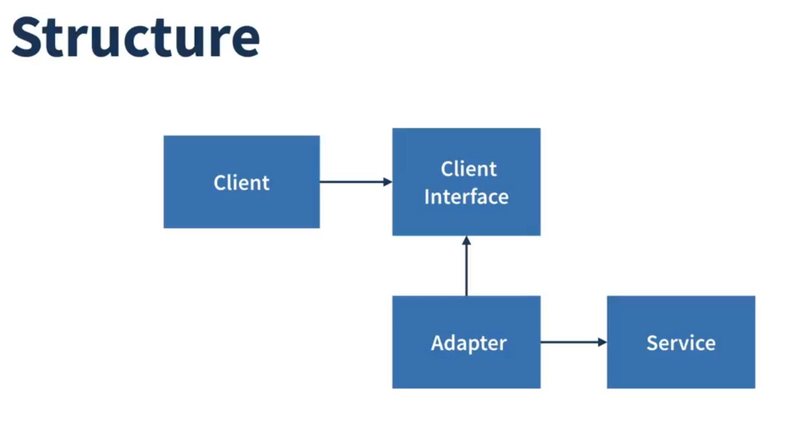

Existen dos formas principales de implementar el patrón Adapter:

-   **Adaptador de Objeto (Object Adapter):** Esta implementación utiliza la composición de objetos. El adaptador contiene una instancia del servicio (el objeto que se adapta). Las llamadas del cliente al adaptador se traducen en llamadas a los métodos del objeto de servicio envuelto. Esta es la forma más común y flexible, especialmente en lenguajes que no soportan la herencia múltiple de clases como TypeScript.
-   **Adaptador de Clase (Class Adapter):** Esta implementación utiliza la herencia. El adaptador hereda de la clase del cliente (o implementa su interfaz) y también de la clase del servicio. Esta opción solo es posible en lenguajes que admiten herencia múltiple de clases.

### ¿Cuándo utilizarlo?

*   **Usa el patrón Adapter cuando quieras usar una clase existente, pero su interfaz no sea compatible con el resto de tu código.**
*   **Usa el patrón cuando quieras reutilizar varias subclases existentes que carecen de alguna funcionalidad común que no se puede agregar a la superclase.**

### Pros y Contras

#### Pros

*   *Principio de Responsabilidad Única*. Puedes separar la conversión de la interfaz o de los datos de la lógica de negocio principal del programa.
*   *Principio de Abierto/Cerrado*. Puedes introducir nuevos tipos de adaptadores en el programa sin romper el código cliente existente, siempre que trabajen con los adaptadores a través de la interfaz del cliente.

#### Contras

*   La complejidad general del código aumenta, ya que necesitas introducir un conjunto de nuevas interfaces y clases. A veces es más sencillo cambiar la clase de servicio para que coincida con el resto de tu código.

---

## Patrón de Diseño Composite (Compuesto)

**Composite** es un patrón de diseño estructural que te permite componer objetos en estructuras de árbol y luego trabajar con estas estructuras como si fueran objetos individuales.

### Problema que resuelve

Imagina que tienes dos tipos de objetos: `Productos` y `Cajas`. Una `Caja` puede contener varios `Productos`, así como otras `Cajas`. Estas pequeñas `Cajas` también pueden contener algunos `Productos` o incluso `Cajas` más pequeñas, y así sucesivamente.

Digamos que decides crear un sistema de pedidos. Los pedidos podrían contener tanto productos simples sin empaquetar como cajas llenas de productos. ¿Cómo calcularías el precio total de dicho pedido?

Tendrías que desenvolver todas las cajas, sumar los precios de todos los productos y luego sumar los precios de las cajas. Sería un código muy complicado y propenso a errores, ya que tendrías que conocer las clases concretas de los objetos con los que trabajas.

### ¿Cómo funciona?

El patrón Composite sugiere que trabajes con `Productos` y `Cajas` a través de una interfaz común que declara un método para calcular el precio total.

Este método sería simple para un producto, simplemente devolvería su propio precio. Pero para una caja, iría a través de cada artículo que contiene, le preguntaría su precio y luego devolvería el total de esta caja. Si uno de los artículos es otra caja, esta caja también comenzaría a recorrer su propio contenido y así sucesivamente, hasta que se calculen los precios de todos los componentes.

La mayor ventaja de este enfoque es que no necesitas preocuparte por las clases concretas de los objetos que componen un árbol. No necesitas saber si un objeto es un producto simple o una caja compleja. Puedes tratarlos a todos por igual a través de la interfaz común.

### Estructura

1.  La interfaz **Componente** describe las operaciones que son comunes tanto para los elementos simples como para los complejos del árbol.
2.  La **Hoja (Leaf)** es un elemento básico de un árbol que no tiene sub-elementos. La mayoría de las veces, los componentes hoja son los que hacen el trabajo real, ya que no tienen a nadie a quien delegar el trabajo.
3.  El **Contenedor (Composite)** es un elemento que tiene sub-elementos: hojas u otros contenedores. Un contenedor no conoce las clases concretas de sus hijos. Funciona con todos los sub-elementos solo a través de la interfaz del componente.
4.  El **Cliente** trabaja con todos los elementos a través de la interfaz del componente.

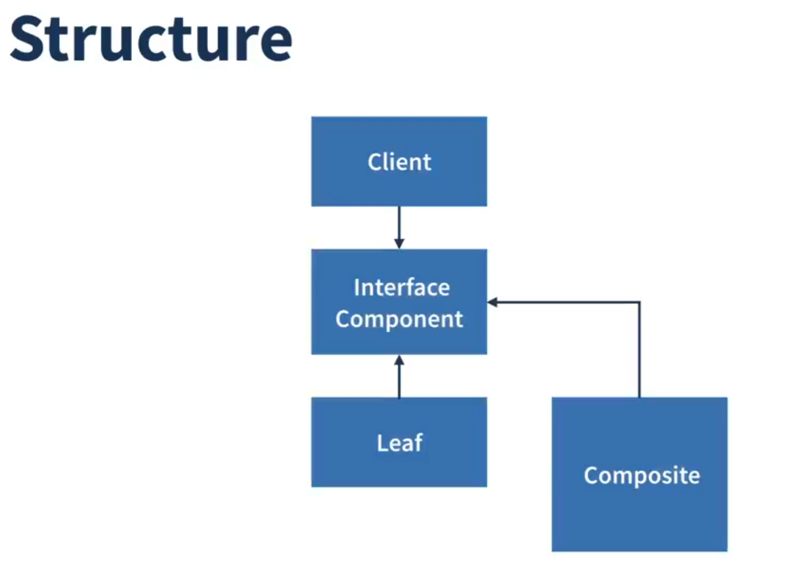

### ¿Cuándo utilizarlo?

*   **Usa el patrón Composite cuando tengas que implementar una estructura de objetos con forma de árbol.**
*   **Usa el patrón cuando quieras que el código cliente trate de la misma manera tanto a los objetos simples como a los complejos.**

### Pros y Contras

#### Pros

*   Puedes trabajar con estructuras de árbol complejas de forma más conveniente: usa polimorfismo y recursividad a tu favor.
*   *Principio de Abierto/Cerrado*. Puedes introducir nuevos tipos de elementos en la aplicación sin romper el código existente que trabaja con el árbol.

#### Contras

*   Puede ser difícil proporcionar una interfaz común para clases que tienen funcionalidades muy diferentes. En ciertos escenarios, tendrías que generalizar en exceso la interfaz del componente, lo que la haría más difícil de comprender.

---

## Patrón de Diseño Decorator (Decorador)

**Decorator** es un patrón de diseño estructural que te permite añadir nuevas funcionalidades a un objeto colocando estos objetos dentro de "envoltorios" especiales que contienen las funcionalidades.

### Problema que resuelve

Imagina que estás trabajando en una biblioteca de notificaciones que permite a otras aplicaciones notificar a sus usuarios sobre eventos importantes.

La versión inicial de la biblioteca solo tenía la clase `Notificador` que enviaba alertas de texto simples a una lista de correos electrónicos que el cliente proporcionaba.

En algún momento, te das cuenta de que los usuarios de la biblioteca querrían más que solo notificaciones por correo electrónico. Muchos de ellos querrían recibir notificaciones de SMS. Otros querrían recibir notificaciones de Facebook. Y, por supuesto, hay gente que querría recibir notificaciones de Slack.

¿Cómo implementarías esto? Podrías crear subclases para cada tipo de notificación, como `NotificadorSMS`, `NotificadorFacebook`, etc. Pero este enfoque tiene un gran problema: si un usuario quiere recibir notificaciones de varios tipos a la vez, tendrías que crear subclases combinadas como `NotificadorFacebookSMS`. Esto llevaría a una explosión de clases.

### ¿Cómo funciona?

El patrón Decorator te permite envolver un objeto con otros objetos que "decoran" el objeto original con nuevas funcionalidades.

El patrón sugiere que crees una interfaz `Componente` y que tanto el objeto original como los decoradores la implementen. El cliente puede entonces trabajar con todos los objetos a través de esta interfaz.

Un decorador es un objeto que envuelve a otro objeto. El decorador implementa la misma interfaz que el objeto que envuelve. El decorador delega todo el trabajo al objeto envuelto, pero también puede añadir algo propio antes o después de la delegación.

Puedes envolver un objeto en múltiples capas de decoradores.

### Estructura

1.  La interfaz **Componente** declara la interfaz común tanto para los envoltorios como para los objetos envueltos.
2.  El **Componente Concreto** es la clase de objetos que se envuelven. Define el comportamiento básico, que puede ser alterado por los decoradores.
3.  La clase **Decorador Base** tiene un campo para referenciar un objeto envuelto. El tipo del campo debe ser la interfaz del componente para que pueda contener tanto componentes concretos como decoradores. El decorador base delega todo el trabajo al objeto envuelto.
4.  Los **Decoradores Concretos** definen funcionalidades adicionales que se pueden añadir a los componentes dinámicamente. Los decoradores concretos sobrescriben los métodos del decorador base y ejecutan su comportamiento antes o después de llamar al método padre.
5.  El **Cliente** puede envolver componentes en múltiples capas de decoradores, siempre que trabaje con todos los objetos a través de la interfaz del componente.

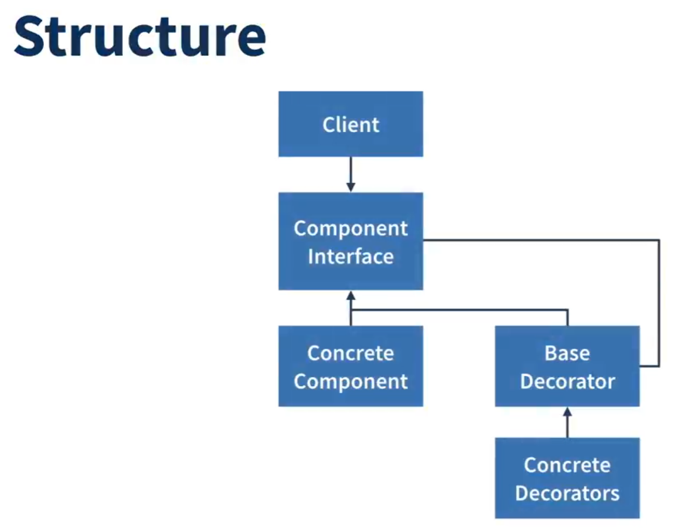

### ¿Cuándo utilizarlo?

*   **Usa el patrón Decorator cuando necesites poder asignar responsabilidades adicionales a los objetos en tiempo de ejecución sin romper el código que utiliza estos objetos.**
*   **Usa el patrón cuando no sea posible o sea inconveniente extender el comportamiento de un objeto mediante la herencia.**

### Pros y Contras

#### Pros

*   Puedes extender el comportamiento de un objeto sin hacer una nueva subclase.
*   Puedes añadir o quitar responsabilidades de un objeto en tiempo de ejecución.
*   Puedes combinar varias responsabilidades envolviendo un objeto con varios decoradores.
*   *Principio de Responsabilidad Única*. Puedes dividir una clase monolítica que implementa muchas variantes de comportamiento en varias clases más pequeñas.

#### Contras

*   Puede ser difícil eliminar un envoltorio específico de la pila de envoltorios.
*   Puede ser difícil implementar un decorador de tal manera que su comportamiento no dependa del orden en la pila de decoradores.
*   La configuración inicial del código puede ser complicada, ya que necesitas introducir muchas clases pequeñas nuevas.

---

## Patrón de Diseño Facade (Fachada)

**Facade** es un patrón de diseño estructural que proporciona una interfaz simplificada a una biblioteca, un framework o cualquier otro conjunto complejo de clases.

### Problema que resuelve

Imagina que tu código debe trabajar con un gran número de objetos que pertenecen a una biblioteca o framework sofisticado. Normalmente, necesitarías inicializar todos esos objetos, llevar un registro de las dependencias, ejecutar los métodos en el orden correcto, y así sucesivamente.

Como resultado, la lógica de negocio de tus clases se vería estrechamente acoplada a los detalles de implementación de las clases de terceros, haciéndola difícil de comprender y mantener.

Por ejemplo, considera un framework que convierte videos a diferentes formatos. Aunque parece muy útil, la primera vez que lo usas puede ser intimidante. Requiere que instancies docenas de clases diferentes, cargues archivos de configuración, inicialices codecs, etc. Toda esta complejidad se filtra a tu código cliente, haciéndolo más difícil de leer y mantener.

### ¿Cómo funciona?

Una fachada es una clase que proporciona una interfaz simple a un subsistema complejo que contiene muchas partes móviles. Una fachada puede proporcionar una funcionalidad limitada en comparación con trabajar directamente con el subsistema. Sin embargo, solo incluye las características que realmente le importan a los clientes.

Tener una fachada es útil cuando necesitas integrar tu aplicación con una biblioteca sofisticada que tiene docenas de características, pero solo necesitas una pequeña parte de su funcionalidad.

La fachada proporciona un punto de acceso simple a un subsistema complejo. Esto puede ser especialmente útil cuando trabajas con APIs complejas o frameworks que requieren muchos pasos de configuración.

### Estructura

1.  La **Fachada** proporciona un acceso conveniente a una parte particular de la funcionalidad del subsistema. Sabe a dónde dirigir la petición del cliente y cómo operar todas las partes móviles.
2.  Se puede crear una **Fachada Adicional** para evitar contaminar una única fachada con características no relacionadas que podrían convertirla en otra estructura compleja. Las fachadas adicionales pueden ser utilizadas tanto por clientes como por otras fachadas.
3.  El **Subsistema Complejo** consiste en docenas de objetos diversos. Para lograr que todos hagan algo significativo, tienes que profundizar en los detalles de implementación del subsistema, como inicializar objetos en el orden correcto y suministrarles datos en el formato adecuado.
4.  El **Cliente** utiliza la fachada en lugar de llamar directamente a los objetos del subsistema.

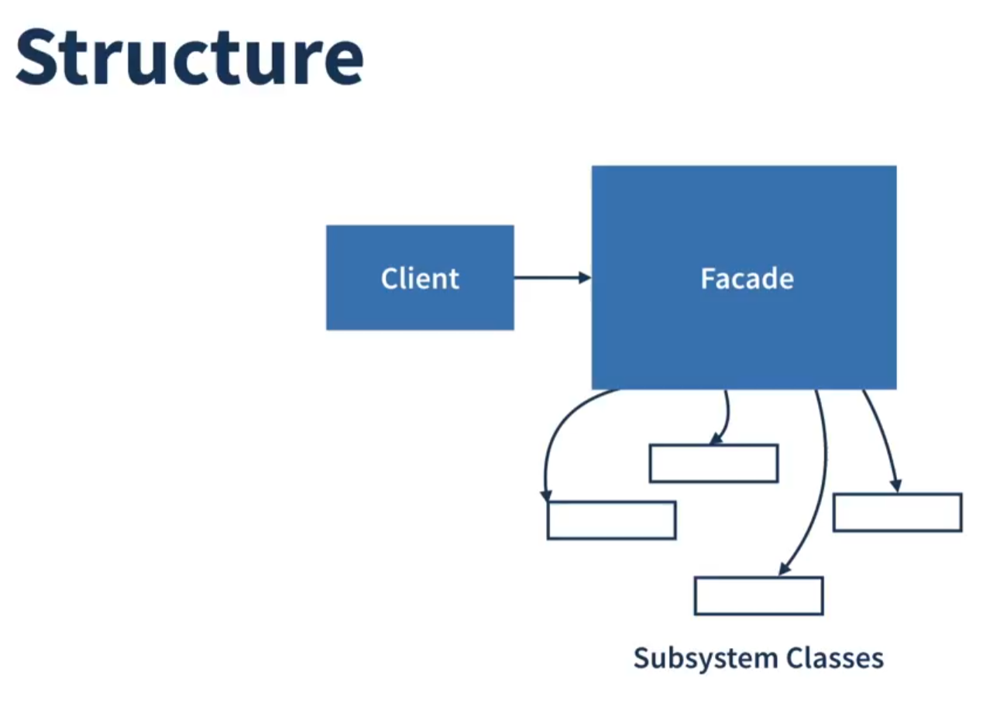

### ¿Cuándo utilizarlo?

*   **Usa el patrón Facade cuando necesites una interfaz limitada pero directa a un subsistema complejo.**
*   **Usa el patrón Facade cuando quieras estructurar un subsistema en capas.**

### Pros y Contras

#### Pros

*   Puedes aislar tu código de la complejidad de un subsistema.
*   Reduces el acoplamiento entre el código cliente y las clases del subsistema.
*   Simplifica el uso de subsistemas complejos.

#### Contras

*   Una fachada puede convertirse en un objeto todopoderoso acoplado a todas las clases de una aplicación.

---

## Patrón de Diseño Iterator (Iterador)

**Iterator** es un patrón de diseño de comportamiento que permite recorrer elementos de una colección sin exponer su representación subyacente (lista, pila, árbol, etc.).

### Problema que resuelve

Las colecciones son uno de los tipos de datos más utilizados en programación. Sin embargo, una colección es tan solo un contenedor para un grupo de objetos.

La mayoría de las colecciones almacenan sus elementos en listas simples. Sin embargo, algunas de ellas se basan en pilas, árboles, grafos y otras estructuras de datos complejas.

Pero independientemente de cómo esté estructurada una colección, debe proporcionar una forma de acceder a sus elementos para que otro código pueda utilizar dichos elementos. Debería haber una forma de recorrer cada elemento de la colección sin acceder a los mismos elementos una y otra vez.

Esto puede parecer un trabajo fácil si tienes una colección basada en una lista. En este caso solo tienes que recorrer todos los elementos en bucle. Pero, ¿cómo recorres secuencialmente elementos de una estructura de datos compleja como un árbol? Por ejemplo, un día puede bastarte con un recorrido en profundidad de un árbol. Al día siguiente puede que necesites un recorrido en anchura. Y la semana siguiente, puede que necesites algo diferente, como un acceso aleatorio a los elementos del árbol.

### ¿Cómo funciona?

La idea principal del patrón Iterator es extraer el comportamiento de recorrido de una colección y colocarlo en un objeto separado llamado *iterador*.

Además de implementar el algoritmo en sí, un objeto iterador encapsula todos los detalles del recorrido, como la posición actual y cuántos elementos quedan hasta el final. Debido a esto, varios iteradores pueden recorrer la misma colección al mismo tiempo, independientemente los unos de los otros.

Normalmente, los iteradores aportan un método primario para extraer elementos de la colección. El cliente puede continuar ejecutando este método hasta que no devuelva nada, lo que significa que el iterador ha recorrido todos los elementos.

### Estructura

1.  La interfaz **Iterador** declara las operaciones necesarias para recorrer una colección: extraer el siguiente elemento, recuperar la posición actual, reiniciar la iteración, etc.
2.  Los **Iteradores Concretos** implementan algoritmos específicos para recorrer una colección. El objeto iterador debe rastrear el progreso del recorrido por su cuenta. Esto permite a varios iteradores recorrer la misma colección con independencia entre sí.
3.  La interfaz **Colección** declara uno o varios métodos para obtener iteradores compatibles con la colección. Observa que el tipo de retorno de los métodos debe declararse como la interfaz iterador, de modo que las colecciones concretas puedan devolver varios tipos de iteradores.
4.  Las **Colecciones Concretas** devuelven nuevas instancias de una clase iteradora concreta particular cada vez que el cliente solicita una. Te puede estar preguntando: ¿dónde está el resto del código de la colección? No te preocupes, debe estar en la misma clase. Lo que pasa es que estos detalles no son fundamentales para el patrón en sí, por lo que los omitimos.
5.  El **Cliente** debe funcionar con colecciones e iteradores a través de sus interfaces. De esta forma, el cliente no se acopla a clases concretas, permitiéndote utilizar varias colecciones e iteradores con el mismo código cliente.

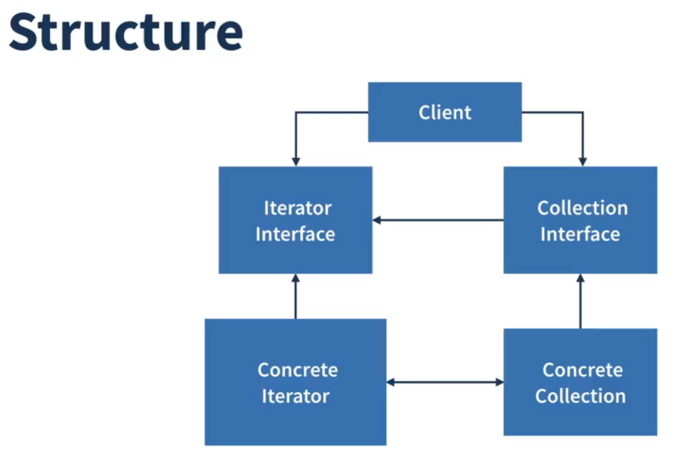

### ¿Cuándo utilizarlo?

*   **Usa el patrón Iterator cuando tu colección tenga una estructura de datos compleja a nivel interno, pero quieras ocultar su complejidad a los clientes.**
*   **Usa el patrón para reducir la duplicación del código de recorrido a lo largo de tu aplicación.**
*   **Usa el patrón Iterator cuando quieras que tu código sea capaz de recorrer diferentes estructuras de datos.**

### Pros y Contras

#### Pros

*   *Principio de Responsabilidad Única*. Puedes limpiar el código cliente y las colecciones extrayendo algoritmos de recorrido voluminosos y colocándolos en clases separadas.
*   *Principio de Abierto/Cerrado*. Puedes implementar nuevos tipos de colecciones e iteradores y pasarlos al código existente sin descomponer nada.
*   Puedes iterar sobre la misma colección en paralelo porque cada objeto iterador contiene su propio estado de iteración.
*   Por la misma razón, puedes retrasar una iteración y continuar cuando sea necesario.

#### Contras

*   Aplicar el patrón puede resultar excesivo si tu aplicación funciona únicamente con colecciones sencillas.
*   Utilizar un iterador puede ser menos eficiente que recorrer directamente los elementos de algunas colecciones especializadas.

---

## Patrón de Diseño State (Estado)

**State** es un patrón de diseño de comportamiento que permite que un objeto altere su comportamiento cuando su estado interno cambia. Parece como si el objeto cambiara su clase.

### Problema que resuelve

El patrón State está estrechamente relacionado con el concepto de la *Máquina de Estados Finitos*.

La idea principal es que, en cualquier momento dado, un programa puede encontrarse en un número finito de *estados*. Dentro de cada estado único, el programa se comporta de forma diferente y puede cambiar de un estado a otro instantáneamente. Sin embargo, dependiendo del estado actual, el programa puede cambiar o no a otros estados. Estas reglas de cambio llamadas *transiciones* también son finitas y predeterminadas.

También puedes aplicar esta metodología a los objetos. Imagina que tienes una clase `Documento`. Un documento puede encontrarse en uno de tres estados: `Borrador`, `Moderación` y `Publicado`. El método `publicar` del documento funciona de forma ligeramente diferente en cada estado.

### ¿Cómo funciona?

El patrón State sugiere que crees nuevas clases para todos los estados posibles de un objeto y extraigas todos los comportamientos específicos del estado para colocarlos dentro de esas clases.

En lugar de implementar todos los comportamientos por su cuenta, el objeto original, llamado *contexto*, almacena una referencia a uno de los objetos de estado que representa su estado actual y delega todo el trabajo relacionado con el estado a ese objeto.

Para hacer la transición del contexto a otro estado, sustituye el objeto de estado activo por otro objeto que represente ese nuevo estado. Esto solo es posible si todas las clases de estado siguen la misma interfaz y el propio contexto funciona con esos objetos a través de esa interfaz.

### Estructura

1.  El **Contexto** almacena una referencia a uno de los objetos de estado concreto y le delega todo el trabajo específico del estado. El contexto se comunica con el objeto de estado a través de la interfaz de estado. El contexto expone un modificador (setter) para pasarle un nuevo objeto de estado.
2.  La interfaz **Estado** declara los métodos específicos del estado. Estos métodos deben tener sentido para todos los estados concretos, porque no querrás que algunos de tus estados tengan métodos inútiles que nunca son invocados.
3.  Los **Estados Concretos** proporcionan sus propias implementaciones para los métodos específicos del estado. Para evitar la duplicación de código similar a través de varios estados, puedes proporcionar clases abstractas intermedias que encapsulen algún comportamiento común.
4.  Tanto el contexto como los estados concretos pueden establecer el siguiente estado del contexto y realizar la transición de estado sustituyendo el objeto de estado vinculado al contexto.

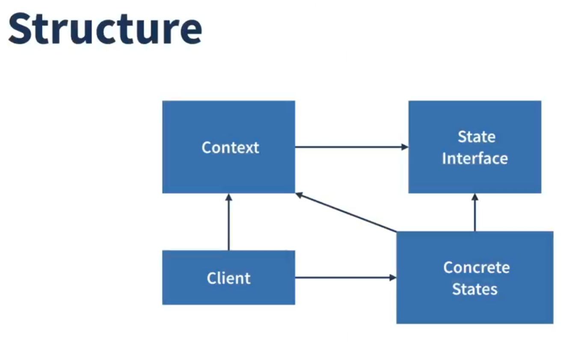

### ¿Cuándo utilizarlo?

*   **Usa el patrón State cuando tengas un objeto que se comporta de forma diferente dependiendo de su estado actual, el número de estados sea enorme, y el código específico del estado cambie con frecuencia.**
*   **Usa el patrón cuando tengas una clase contaminada con enormes condicionales que alteran el modo en que se comporta la clase de acuerdo con los valores actuales de los campos de la clase.**
*   **Usa el patrón State cuando tengas mucho código duplicado a través de estados similares y transiciones de una máquina de estados basada en condiciones.**

### Pros y Contras

#### Pros

*   *Principio de Responsabilidad Única*. Organiza el código relacionado con estados particulares en clases separadas.
*   *Principio de Abierto/Cerrado*. Introduce nuevos estados sin cambiar clases de estado existentes o la clase contexto.
*   Simplifica el código del contexto eliminando voluminosos condicionales de máquina de estados.

#### Contras

*   Aplicar el patrón puede resultar excesivo si una máquina de estados solo tiene unos pocos estados o raramente cambia.

---

## Patrón de Diseño Template Method (Método Plantilla)

**Template Method** es un patrón de diseño de comportamiento que define el esqueleto de un algoritmo en la superclase pero deja que las subclases sobrescriban pasos específicos del algoritmo sin cambiar su estructura.

### Problema que resuelve

Imagina que estás creando una aplicación de minería de datos que analiza documentos corporativos. Los usuarios alimentan la aplicación con documentos en varios formatos (PDF, DOC, CSV), y ésta intenta extraer la información significativa de estos documentos en un formato uniforme.

La primera versión de la aplicación solo funcionaba con archivos DOC. En la siguiente versión, era capaz de soportar archivos CSV. Un mes después, le "enseñaste" a extraer datos de archivos PDF.

En cierto momento te das cuenta de que las tres clases tienen mucho código similar. Aunque el código para gestionar distintos formatos de datos es totalmente diferente en todas las clases, el código para procesar y analizar los datos es casi idéntico. ¿No sería genial deshacerse de la duplicación de código, dejando intacta la estructura del algoritmo?

### ¿Cómo funciona?

El patrón Template Method sugiere que dividas un algoritmo en una serie de pasos, conviertas estos pasos en métodos, y coloques una serie de llamadas a esos métodos dentro de un único *método plantilla*. Los pasos pueden ser `abstractos`, o contar con una implementación por defecto. Para utilizar el algoritmo, el cliente debe proporcionar su propia subclase, implementar todos los pasos abstractos, y sobrescribir algunos de los opcionales si es necesario (pero no el propio método plantilla).

### Estructura

1.  La **Clase Abstracta** declara métodos que actúan como pasos de un algoritmo, así como el propio método plantilla que invoca estos métodos en un orden específico. Los pasos pueden declararse `abstractos` o contar con una implementación por defecto.
2.  Las **Clases Concretas** pueden sobrescribir todos los pasos, pero no el método plantilla en sí.

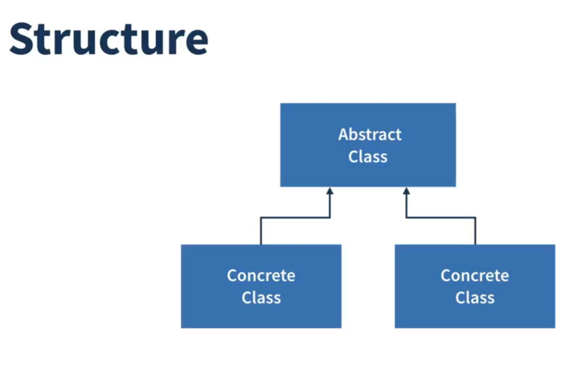

### ¿Cuándo utilizarlo?

*   **Usa el patrón Template Method cuando quieras permitir a los clientes que extiendan únicamente pasos particulares de un algoritmo, pero no todo el algoritmo o su estructura.**
*   **Usa el patrón cuando tengas varias clases que contengan algoritmos casi idénticos, con algunas diferencias menores.**

### Pros y Contras

#### Pros

*   Puedes permitir a los clientes que sobrescriban únicamente ciertas partes de un algoritmo grande, para que les afecten menos los cambios que tienen lugar en otras partes del algoritmo.
*   Puedes colocar el código duplicado dentro de una superclase.

#### Contras

*   Algunos clientes pueden verse limitados por el esqueleto proporcionado de un algoritmo.
*   Puede que violes el *Principio de Sustitución de Liskov* suprimiendo una implementación por defecto de un paso a través de una subclase.
*   Los métodos plantilla tienden a ser más difíciles de mantener cuantos más pasos tengan.

---

## Patrón de Diseño Command (Comando)

**Command** es un patrón de diseño de comportamiento que convierte una solicitud en un objeto independiente que contiene toda la información sobre la solicitud. Esta transformación te permite parametrizar los métodos con diferentes solicitudes, retrasar o poner en cola la ejecución de solicitudes y soportar operaciones que no se pueden realizar.

### Problema que resuelve

Imagina que estás trabajando en una nueva aplicación de editor de texto. Tu tarea actual consiste en crear una barra de herramientas con unos cuantos botones para varias operaciones del editor. Creaste una clase `Botón` muy limpia que puede utilizarse para los botones de la barra de herramientas y también para botones genéricos en varios cuadros de diálogo.

Aunque todos estos botones se parecen, se supone que hacen cosas diferentes. ¿Dónde pondrías el código para los varios gestores de clics de estos botones? La solución más simple consiste en crear cientos de subclases para cada lugar donde se utilice el botón. Estas subclases contendrían el código que debería ejecutarse con el clic de un botón.

Pronto te das cuenta de que esta solución es muy deficiente. En primer lugar, tienes una cantidad enorme de subclases, lo cual no sería un problema si no corrieras el riesgo de descomponer el código de esas subclases cada vez que modifiques la clase base `Botón`.

### ¿Cómo funciona?

El buen diseño de software a menudo se basa en el *principio de separación de responsabilidades*, que suele tener como resultado la división de la aplicación en capas. El ejemplo más habitual: una capa para la interfaz gráfica de usuario (GUI) y otra capa para la lógica de negocio.

El patrón Command sugiere que los objetos GUI no envíen estas solicitudes directamente. En lugar de eso, debes colocar todos los detalles de la solicitud, como el objeto que está siendo invocado, el nombre del método y la lista de argumentos, dentro de una clase *comando* separada con un único método que activa esta solicitud.

Los objetos de comando sirven como vínculo entre varios objetos GUI y de lógica de negocio. De ahora en adelante, el objeto GUI no tiene que conocer qué objeto de la lógica de negocio recibirá la solicitud y cómo la procesará. El objeto GUI activa el comando, que gestiona todos los detalles.

### Estructura

1.  La interfaz **Comando** normalmente declara un único método para ejecutar un comando.
2.  El **Comando Concreto** implementa varios tipos de solicitudes. Un comando concreto no se supone que haga el trabajo por su cuenta, sino que pasa la llamada a uno de los objetos de la lógica de negocio. Sin embargo, para lograr simplificar el código, estas clases se pueden fusionar.
3.  El **Receptor** contiene cierta lógica de negocio. Casi cualquier objeto puede actuar como receptor. La mayoría de los comandos solo gestiona los detalles sobre cómo se pasa una solicitud al receptor, mientras que el propio receptor hace el trabajo real.
4.  El **Invocador** (o *emisor*) está asociado con uno o varios comandos. El invocador envía una solicitud al comando.
5.  El **Cliente** crea y configura los objetos de comando concreto. El cliente debe pasar todos los parámetros de la solicitud, incluyendo una instancia del receptor, dentro del constructor del comando.

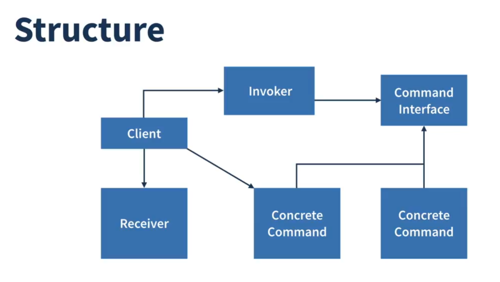

### ¿Cuándo utilizarlo?

*   **Usa el patrón Command cuando quieras parametrizar objetos con operaciones.**
*   **Usa el patrón Command cuando quieras poner operaciones en cola, programar su ejecución, o ejecutarlas de forma remota.**
*   **Usa el patrón Command cuando quieras implementar operaciones reversibles.**

### Pros y Contras

#### Pros

*   *Principio de Responsabilidad Única*. Puedes desacoplar las clases que invocan operaciones de las clases que realizan esas operaciones.
*   *Principio de Abierto/Cerrado*. Puedes introducir nuevos comandos en la aplicación sin descomponer el código cliente existente.
*   Puedes implementar deshacer/rehacer.
*   Puedes implementar la ejecución diferida de operaciones.
*   Puedes ensamblar un grupo de comandos simples para crear uno complejo.

#### Contras

*   El código puede volverse más complicado, ya que estás introduciendo una nueva capa entre emisores y receptores.

---

## Patrón de Diseño Mediator (Mediador)

**Mediator** es un patrón de diseño de comportamiento que reduce las dependencias caóticas entre objetos. El patrón restringe las comunicaciones directas entre los objetos y los obliga a colaborar únicamente a través de un objeto mediador.

### Problema que resuelve

Digamos que tienes un cuadro de diálogo para crear y editar perfiles de cliente. Consiste en varios controles de formulario, como campos de texto, casillas, botones, etc.

Algunos de los elementos del formulario pueden interactuar con otros. Por ejemplo, al seleccionar la casilla "tengo un perro" puede aparecer un campo de texto oculto para introducir el nombre del perro. Otro ejemplo es el botón de envío que tiene que validar los valores de todos los campos antes de guardar los datos.

Al implementar esta lógica directamente dentro del código de los elementos del formulario, haces que las clases de estos elementos sean mucho más difíciles de reutilizar en otros formularios de la aplicación. Por ejemplo, no podrás utilizar esa clase de casilla dentro de otro formulario porque está acoplada al campo de texto del perro. O bien puedes utilizar todas las clases implicadas en representar el formulario del perfil, o no puedes utilizar ninguna.

### ¿Cómo funciona?

El patrón Mediator sugiere que detengas toda comunicación directa entre los componentes que quieres hacer independientes entre sí. En lugar de eso, estos componentes deben colaborar indirectamente, invocando un objeto mediador especial que redirecciona las llamadas a los componentes adecuados. Como resultado, los componentes dependen únicamente de una sola clase mediadora, en lugar de estar acoplados a docenas de sus colegas.

En nuestro ejemplo del formulario de edición del perfil, la propia clase de diálogo puede actuar como mediadora. Lo más probable es que la clase de diálogo ya conozca todos sus subelementos, por lo que ni siquiera será necesario que introduzcas nuevas dependencias en esta clase.

### Estructura

1.  Los **Componentes** son varias clases que contienen cierta lógica de negocio. Cada componente tiene una referencia a una interfaz mediadora, declarada con el tipo de la interfaz mediadora. El componente no conoce la clase real de la mediadora, por lo que puedes reutilizar el componente en otros programas vinculándolo a una mediadora diferente.
2.  La interfaz **Mediadora** declara métodos de comunicación con los componentes, que normalmente incluyen un único método de notificación. Los componentes pueden pasar cualquier contexto como argumentos de este método, incluyendo sus propios objetos, pero solo de tal forma que no haya acoplamiento entre un componente receptor y la clase del emisor.
3.  Los **Mediadores Concretos** encapsulan las relaciones entre varios componentes. Los mediadores concretos a menudo mantienen referencias a todos los componentes que gestionan y en ocasiones gestionan incluso el ciclo de vida de los componentes.
4.  Los componentes no deben conocer otros componentes. Si le sucede algo importante a un componente, o dentro de él, solo debe notificar a la mediadora. Cuando la mediadora recibe la notificación, puede identificar fácilmente al emisor, lo cual puede ser suficiente para decidir qué componente debe activarse en respuesta.

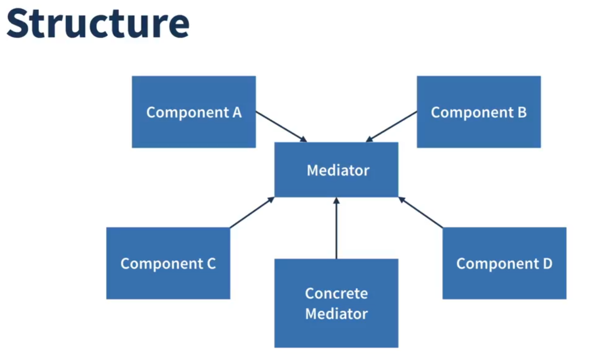

### ¿Cuándo utilizarlo?

*   **Usa el patrón Mediator cuando sea difícil cambiar algunas de las clases porque están muy acopladas a un puñado de otras clases.**
*   **Usa el patrón cuando no puedas reutilizar un componente en un programa diferente porque sea muy dependiente de otros componentes.**
*   **Usa el patrón Mediator cuando te encuentres creando cientos de subclases de componente solo para reutilizar algún comportamiento básico en varios contextos.**

### Pros y Contras

#### Pros

*   *Principio de Responsabilidad Única*. Puedes extraer las comunicaciones entre varios componentes dentro de un solo lugar, haciéndolo más fácil de comprender y mantener.
*   *Principio de Abierto/Cerrado*. Puedes introducir nuevas mediadoras sin tener que cambiar los propios componentes.
*   Puedes reducir el acoplamiento entre varios componentes de un programa.
*   Puedes reutilizar componentes individuales con mayor facilidad.

#### Contras

*   Con el tiempo, una mediadora puede evolucionar hasta convertirse en un *Objeto todopoderoso*.

---

## Patrón de Diseño Observer (Observador)

**Observer** es un patrón de diseño de comportamiento que permite definir un mecanismo de suscripción para notificar a múltiples objetos sobre cualquier evento que le suceda al objeto que están observando.

### Problema que resuelve

Imagina que tienes dos tipos de objetos: un objeto `Cliente` y un objeto `Tienda`. El cliente está muy interesado en una marca particular de producto (digamos, un nuevo modelo de iPhone) que estará disponible en la tienda muy pronto.

El cliente puede visitar la tienda cada día para comprobar la disponibilidad del producto. Pero, mientras el producto no esté disponible, la mayoría de estos viajes serán en vano.

Por otro lado, la tienda podría enviar cientos de correos electrónicos (lo cual se consideraría spam) a todos los clientes cada vez que haya un nuevo producto disponible. Esto ahorraría a los clientes los viajes innecesarios a la tienda, pero, al mismo tiempo, molestaría a otros clientes que no están interesados en los nuevos productos.

Parece que nos encontramos ante un conflicto. O el cliente malgasta tiempo comprobando la disponibilidad del producto, o la tienda malgasta recursos notificando a los clientes equivocados.

### ¿Cómo funciona?

El objeto que tiene un estado interesante suele denominarse *sujeto*, pero, como también va a notificar a otros objetos los cambios en su estado, le llamaremos *notificador*. Todos los demás objetos que quieren rastrear los cambios del estado del notificador, se denominan *suscriptores*.

El patrón Observer sugiere que añadas un mecanismo de suscripción a la clase notificadora para que los objetos individuales puedan suscribirse o desuscribirse de un flujo de eventos que proviene de esa notificadora. ¡No temas! No es tan complicado como parece. En realidad, este mecanismo consiste en: 1) un campo matriz para almacenar una lista de referencias a objetos suscriptores y 2) varios métodos públicos que permiten añadir suscriptores y eliminarlos de esa lista.

### Estructura

1.  El **Notificador** envía eventos de interés a otros objetos. Estos eventos ocurren cuando el notificador cambia su estado o ejecuta algunos comportamientos. Los notificadores contienen una infraestructura de suscripción que permite a nuevos suscriptores unirse y a los actuales abandonar la lista.
2.  Cuando sucede un nuevo evento, el notificador recorre la lista de suscripción e invoca el método de notificación declarado en la interfaz suscriptora en cada objeto suscriptor.
3.  La interfaz **Suscriptor** declara la interfaz de notificación. En la mayoría de los casos, consiste en un único método `actualizar`. El método puede tener varios parámetros que permitan al notificador pasar algunos detalles del evento junto a la actualización.
4.  Los **Suscriptores Concretos** realizan algunas acciones en respuesta a las notificaciones emitidas por el notificador. Todas estas clases deben implementar la misma interfaz de forma que el notificador no esté acoplado a clases concretas.
5.  Normalmente, los suscriptores necesitan cierta información contextual para gestionar correctamente la actualización. Por este motivo, a menudo los notificadores pasan cierta información de contexto como argumentos del método de notificación.

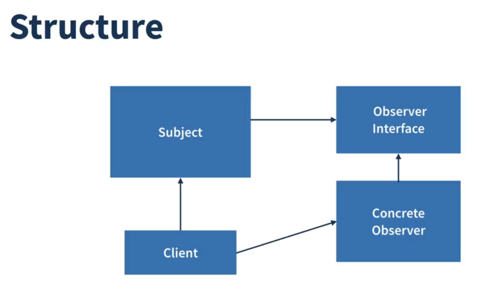

### ¿Cuándo utilizarlo?

*   **Usa el patrón Observer cuando los cambios en el estado de un objeto puedan necesitar cambiar otros objetos, y el grupo de objetos sea desconocido de antemano o cambie dinámicamente.**
*   **Usa el patrón cuando algunos objetos de tu aplicación deban observar a otros, pero solo durante un tiempo limitado o en casos específicos.**

### Pros y Contras

#### Pros

*   *Principio de Abierto/Cerrado*. Puedes introducir nuevas clases suscriptoras sin tener que cambiar el código del notificador (y viceversa si hay una interfaz notificadora).
*   Puedes establecer relaciones entre objetos durante el tiempo de ejecución.

#### Contras

*   Los suscriptores son notificados en un orden aleatorio.

---

## Patrón de Diseño Strategy (Estrategia)

**Strategy** es un patrón de diseño de comportamiento que permite definir una familia de algoritmos, colocar cada uno de ellos en una clase separada y hacer que sus objetos sean intercambiables.

### Problema que resuelve

Un día decidiste crear una aplicación de navegación para viajeros ocasionales. La aplicación giraba en torno a un bonito mapa que ayudaba a los usuarios a orientarse rápidamente en cualquier ciudad.

Una de las funciones más solicitadas para la aplicación era la planificación automática de rutas. Un usuario debía poder introducir una dirección y ver la ruta más rápida a ese destino mostrada en el mapa.

La primera versión de la aplicación solo podía generar las rutas sobre carreteras. Las personas que viajaban en coche estaban muy contentas. Pero, aparentemente, no a todo el mundo le gusta conducir en sus vacaciones. De modo que, en la siguiente actualización, añadiste una opción para crear rutas a pie. Después, añadiste otra opción para permitir a las personas utilizar el transporte público en sus rutas.

Sin embargo, esto era solo el principio. Más tarde planeaste añadir la generación de rutas para ciclistas, y más tarde, otra opción para las rutas por todas las atracciones turísticas de una ciudad.

Aunque desde una perspectiva comercial la aplicación era un éxito, la parte técnica te causaba muchos dolores de cabeza. Cada vez que añadías un nuevo algoritmo de enrutamiento, la clase principal del navegador doblaba su tamaño. En cierto momento, la bestia se volvió demasiado difícil de mantener.

### ¿Cómo funciona?

El patrón Strategy sugiere que tomes esa clase que hace algo específico de muchas formas diferentes y extraigas todos esos algoritmos para colocarlos en clases separadas llamadas *estrategias*.

La clase original, llamada *contexto*, debe tener un campo para almacenar una referencia a una de las estrategias. El contexto delega el trabajo a un objeto de estrategia vinculado en lugar de ejecutarlo por su cuenta.

El contexto no es responsable de seleccionar un algoritmo adecuado para la tarea. En lugar de eso, el cliente pasa la estrategia deseada al contexto. De hecho, el contexto no sabe mucho acerca de las estrategias. Funciona con todas las estrategias a través de la misma interfaz genérica, que solo expone un único método para disparar el algoritmo encapsulado dentro de la estrategia seleccionada.

### Estructura

1.  La clase **Contexto** mantiene una referencia a una de las estrategias concretas y se comunica con este objeto únicamente a través de la interfaz de estrategia.
2.  La interfaz **Estrategia** es común a todas las estrategias concretas. Declara un método que la clase contexto utiliza para ejecutar una estrategia.
3.  Las **Estrategias Concretas** implementan distintas variaciones de un algoritmo que la clase contexto utiliza.
4.  La clase contexto invoca el método de ejecución cada vez que necesita ejecutar el algoritmo. La clase contexto no sabe qué tipo de estrategia funciona o cómo se ejecuta el algoritmo.
5.  El **Cliente** crea un objeto de estrategia específico y lo pasa a la clase contexto. La clase contexto expone un modificador (setter) que permite a los clientes sustituir la estrategia asociada al contexto durante el tiempo de ejecución.

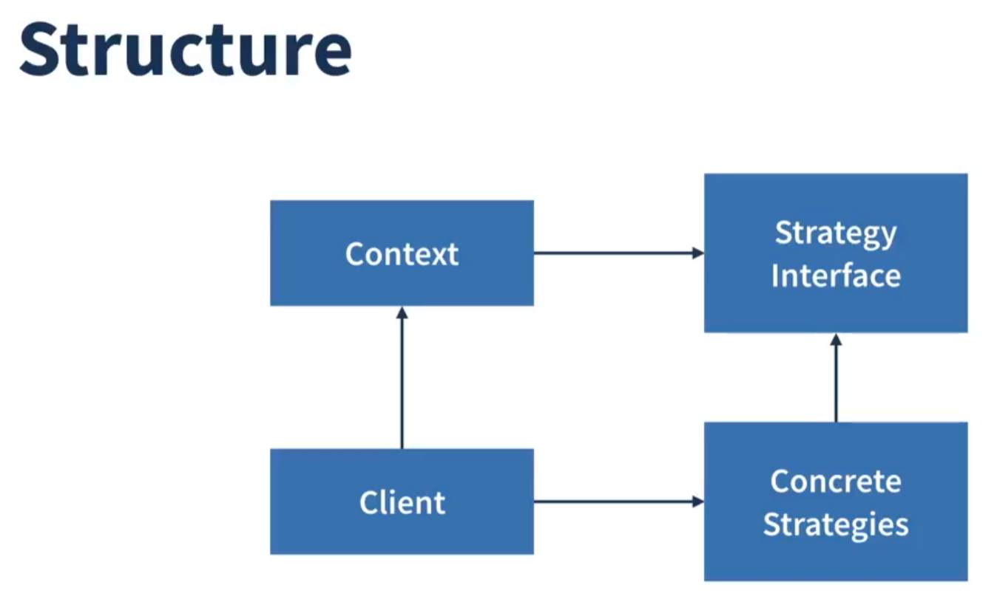

### ¿Cuándo utilizarlo?

*   **Usa el patrón Strategy cuando quieras utilizar distintas variantes de un algoritmo dentro de un objeto y poder cambiar de un algoritmo a otro durante el tiempo de ejecución.**
*   **Usa el patrón Strategy cuando tengas muchas clases similares que solo se diferencien en la forma en que ejecutan cierto comportamiento.**
*   **Usa el patrón para aislar la lógica de negocio de una clase, de los detalles de implementación de algoritmos que pueden no ser tan importantes en el contexto de esa lógica.**
*   **Usa el patrón cuando tu clase tenga un operador condicional masivo que cambie entre distintas variantes del mismo algoritmo.**

### Pros y Contras

#### Pros

*   Puedes intercambiar algoritmos usados dentro de un objeto durante el tiempo de ejecución.
*   Puedes aislar los detalles de implementación de un algoritmo del código que lo utiliza.
*   Puedes sustituir la herencia por composición.
*   *Principio de Abierto/Cerrado*. Puedes introducir nuevas estrategias sin tener que cambiar el contexto.

#### Contras

*   Si solo tienes un par de algoritmos que raramente cambian, no hay una razón real para complicar el programa en exceso con nuevas clases e interfaces que vengan con el patrón.
*   Los clientes deben conocer las diferencias entre estrategias para poder seleccionar la adecuada.
*   Muchos lenguajes de programación modernos tienen soporte de tipo funcional que te permite implementar distintas versiones de un algoritmo dentro de un grupo de funciones anónimas. Entonces podrías utilizar estas funciones exactamente como habrías utilizado los objetos de estrategia, pero sin saturar tu código con clases e interfaces adicionales.

---

## 🤝 Contribuir

¡Las contribuciones son bienvenidas! Si quieres contribuir a este proyecto:

1. 🍴 Haz fork del repositorio
2. 🌟 Crea una rama para tu feature (`git checkout -b feature/AmazingFeature`)
3. 💾 Commit tus cambios (`git commit -m 'Add some AmazingFeature'`)
4. 📤 Push a la rama (`git push origin feature/AmazingFeature`)
5. 🔄 Abre un Pull Request

### ¿Qué puedes aportar?
- 🐛 **Reportar bugs**: Si encuentras algún error
- 💡 **Nuevos patrones**: Implementar patrones adicionales
- 📚 **Mejorar documentación**: Clarificar explicaciones
- 🎨 **Ejemplos adicionales**: Casos de uso más complejos
- 🌐 **Traducciones**: Documentación en otros idiomas

## 📚 Recursos Adicionales

### Libros Recomendados
- 📖 **"Design Patterns: Elements of Reusable Object-Oriented Software"** - Gang of Four
- 📘 **"Head First Design Patterns"** - Eric Freeman & Elisabeth Robson
- 📙 **"Clean Code"** - Robert C. Martin

### Enlaces Útiles
- 🔗 [Refactoring Guru - Design Patterns](https://refactoring.guru/design-patterns)
- 🔗 [TypeScript Handbook](https://www.typescriptlang.org/docs/)
- 🔗 [Design Patterns in TypeScript](https://github.com/torokmark/design_patterns_in_typescript)

## 📄 Licencia

Este proyecto está bajo la Licencia MIT. Ver el archivo [LICENSE](LICENSE) para más detalles.

## 👨‍💻 Autor

**Rafael H** - [@Rafaelh5z](https://github.com/Rafaelh5z)

---

### ⭐ Si este repositorio te ha sido útil, ¡no olvides darle una estrella!

<div align="center">
  <sub>Hecho con ❤️ para la comunidad de desarrolladores</sub>
</div>
